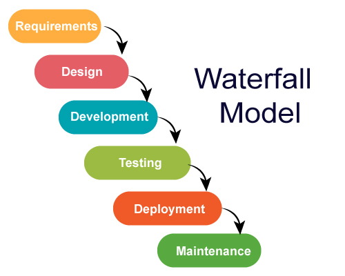
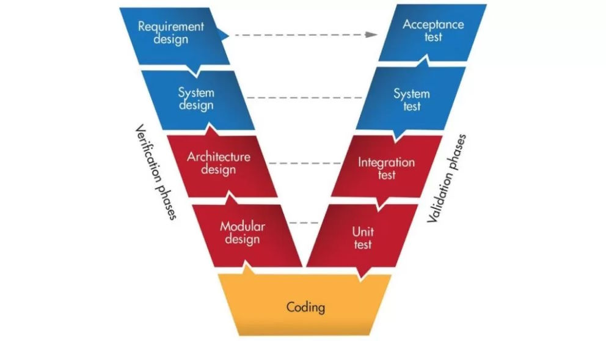
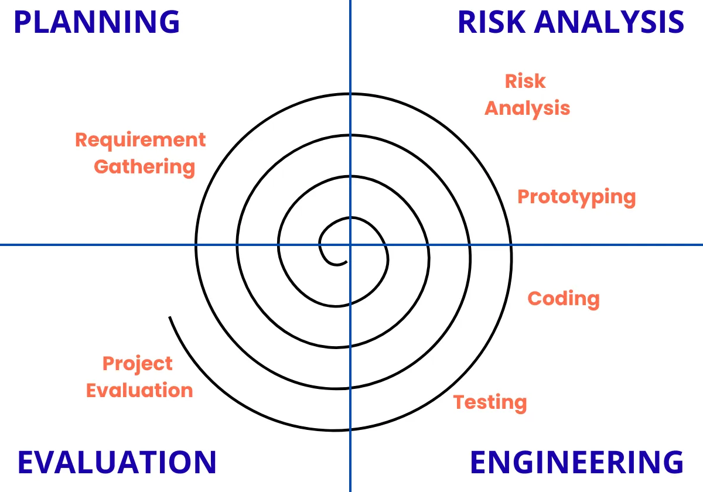
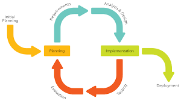

# SDLC

- It is a framework which defines the phase involded in developing software from idea to maintanance.

- Requirement Listing -> Design -> Development -> Testing -> Deployment -> Maintance 

**Requirement Analysis**

- understand what the customer wants
- get all business and rechnical requirements
- E.g. - User shuould be able to login and view Dashboard

**Design**

- System Architecture
- Database Design
- UI/UX (Layout of app)
- E.g. HLD (High Level of Design), LLD (Low Level of Design)

**Development (Coding)**

- developer will write code
- follow rule for writing code

**Testing**

- Verify Software works as expected

**Deployment**

- software released to production
- installed on servers

**Maintanance**

- Fix Bug
- improove performance
- improove features

## Waterfall Model

**Key Points**

- Linear and Sequential
- Easy to understand and execute
- Strong documentation
- Not flexible
- Late feedback
- high risk if req change

**Example**

- I want to build a house
- first finalize a design, then start building
- no change allowed once the construction starts

## V Model (Verification and Validation Model)

- Testing Planned Early
- Clear Mapping between dev and Test phase
- better quality then waterfall
- still rigid
- changes are costly
- not ideal model for fast changing req.

- example: Car Braking System

## Spiral Model

- More focused on Risk Analysis
- make changes in evalution phase as per the customer feedback

## Iterative Model

- iterative (Repetative) approach 
- after each iteration tetsing and evaluation will happen
- we can make changes to existing app