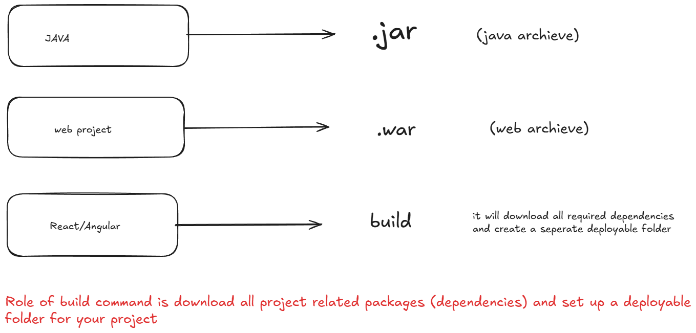
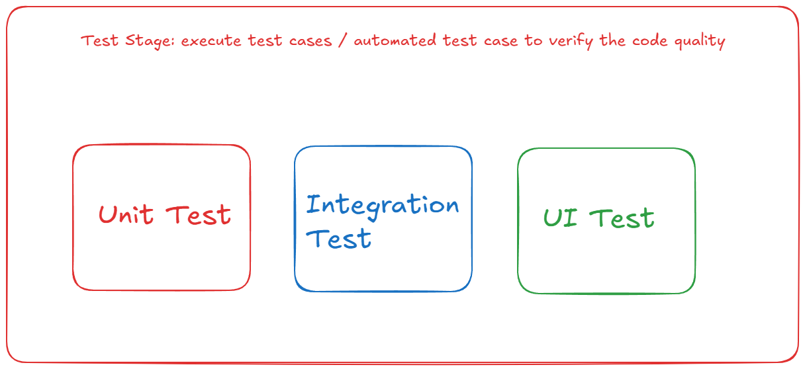
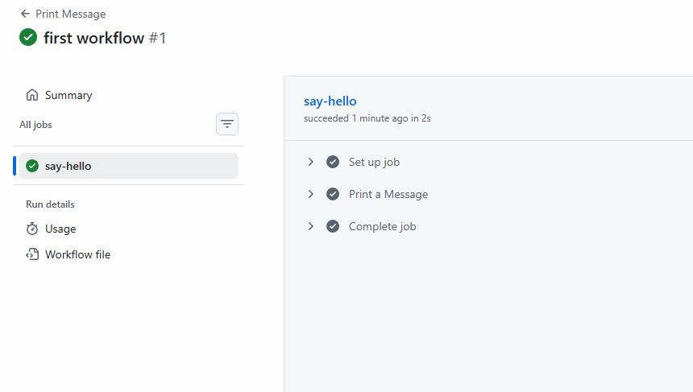

# CI Fundamentals

## What is CI?

- CI is the development process where developers regularly merge code into shared repo and automated pipelines run tests and check to ensure the code is always in deployable state.

## Why?

- detect bugs early
- improve code quality
- reduce integration issue
- automatte repetitive checks
- faster feedback for developers

## How to Implement? using tools

- Github Actions
- Jenkins
- Travis CI
- Circle CI

## Github Actions

- Github Actions is built in CI/CD tool of Github which is used to run automated pipelines in Github Repo for build, test and deploy application.
- Simply, its CI/CD engine which is directly inside github Repo.
- to implement we need yml/yaml file

## CI stages

1. Build



2. Test




## Let's Setup a Simple CI Work flow

**YAML/YML**

- we need to create yml file which is human redable configuration language which is used to define settings, workflows, pipelines and structured data.
- the file extension is .yml / .yaml

**YML Rules**

- indentation (use space not tab)
- give values in key: value format
- multiple value like list:
```md
 - user1
 - user2
 - user3
```
- no need of {} braces


## Let's Execute

- create a folder github-workflow-demo
- move to that folder
- open folder in cmd & vs code for yml file
- your workflows must be at folder
- .github/workflows (create folder named .github under that create folder named workflows)
- here create file print.yml

```yml
name: Print Message
on:
  push:
    branches:
      - main

jobs:
  say-hello:
    runs-on: ubuntu-latest

    steps:
      - name: Print a Message
        run: echo "Hello! A Push detected on Main Branch"
```

- save your YML file and push code on Github
- When github detect push the Action should be executed authomatically

**Where to Check?**

- in Repo - go to Action tab and you can see job build successfully or not

