# Create EC2 instance

- EC2 - Elastic Compute Cloud
- used to create VM/ virtual Server

- Login to your AWS Console
- Search For EC2 -> click on the same and you can see EC2 Dashboard

- on dashboard you can see button to create instance

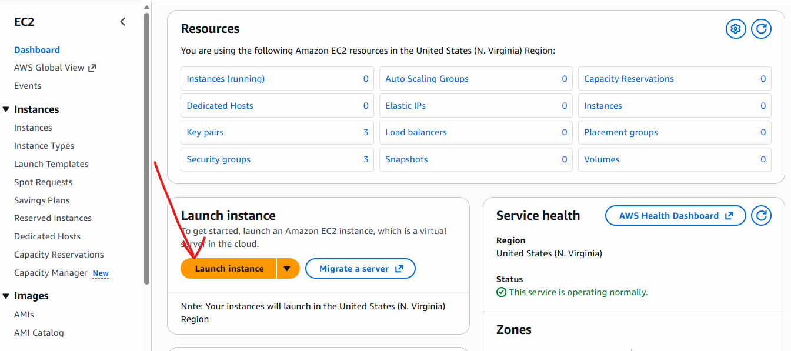

- configure name, image and count

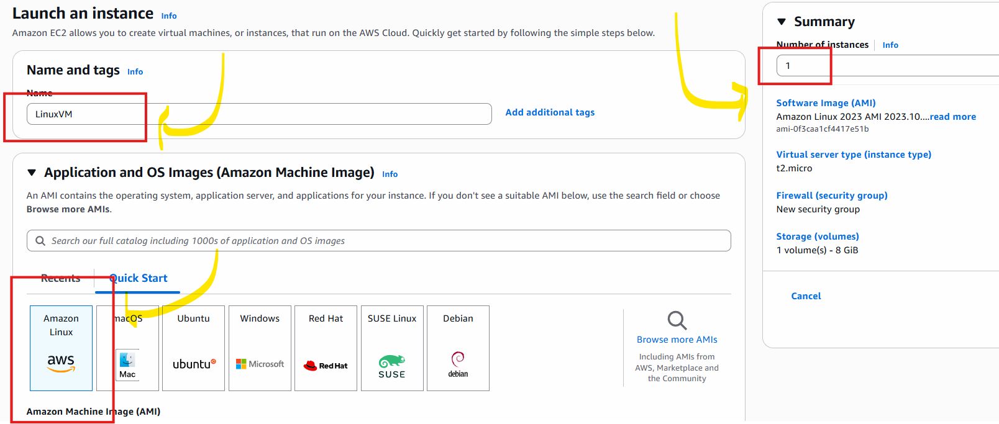

- select instance type: t2.micro

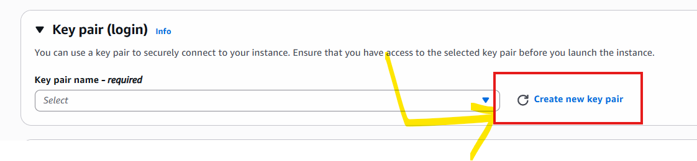

- Create Key .pem with RSA algorithm

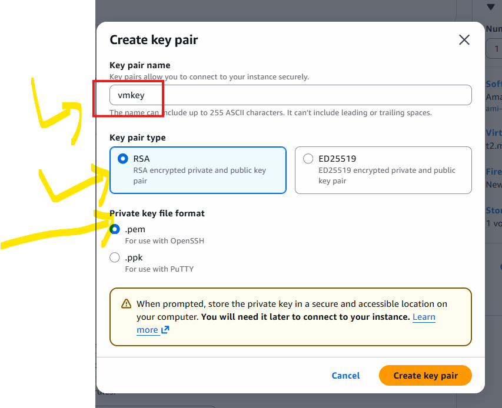

- once key created it will be downloaded to your system, make sure you keep it secretly.

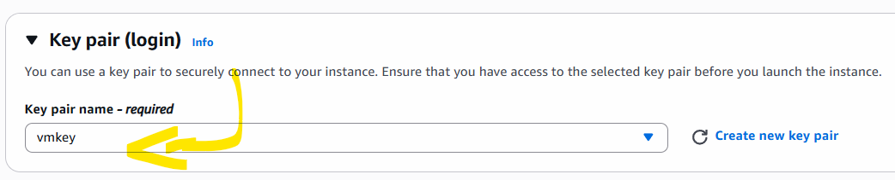

- Network Settings (firewall and VPC setting)
- By default we will use Default VPC
- firewall settings we can define using security group

- Edit Network settings for firewall

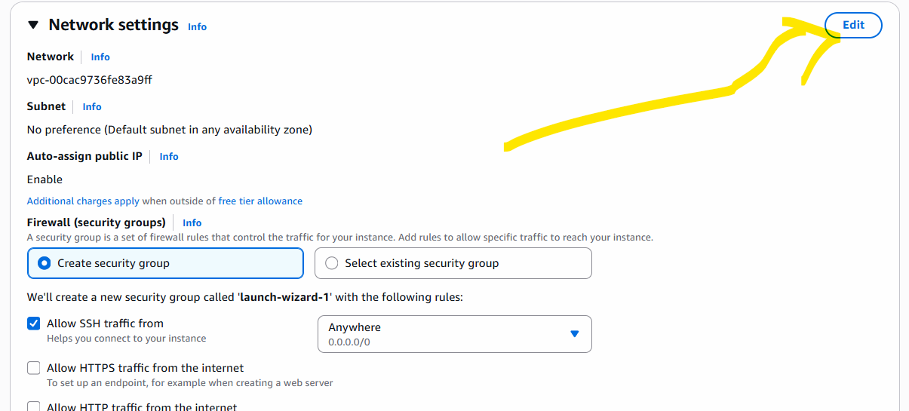

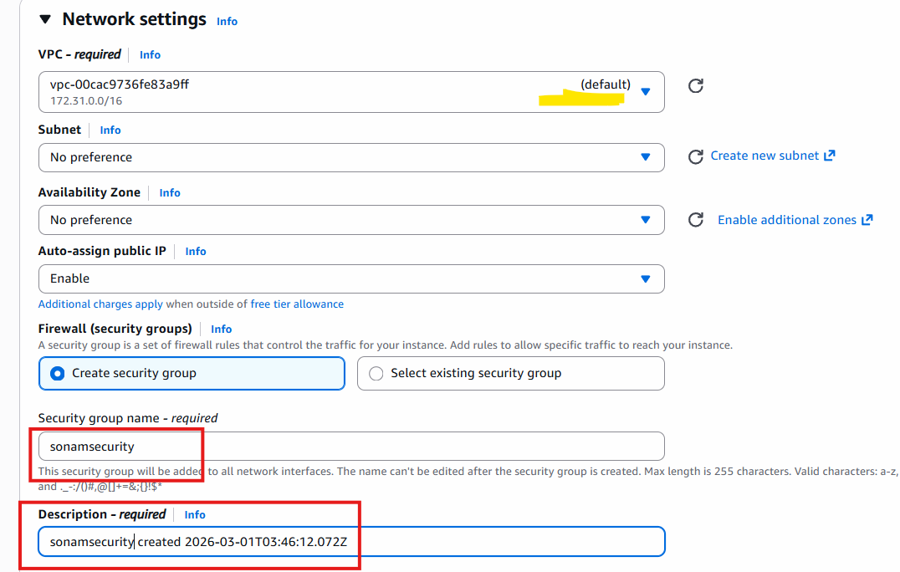

- keep Default SSH as it is and click on add new group rule

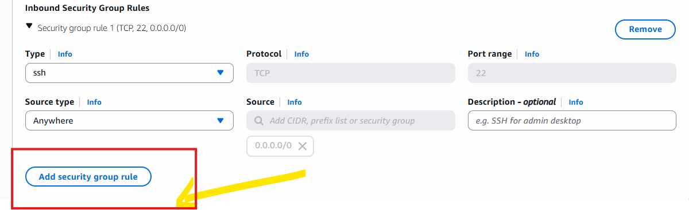

- edit inbound rules to allow Traffic to server

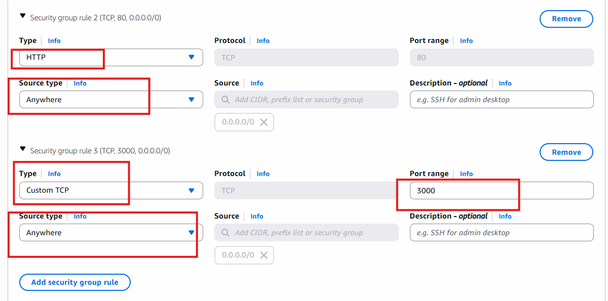

- Storage Configurations

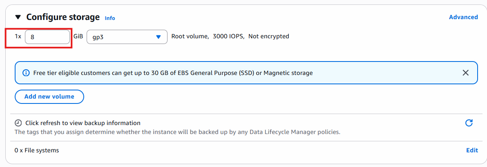

- Review your Configuration and then Launch Instance

- click on Instance Id generated and you can see summary of instance like this

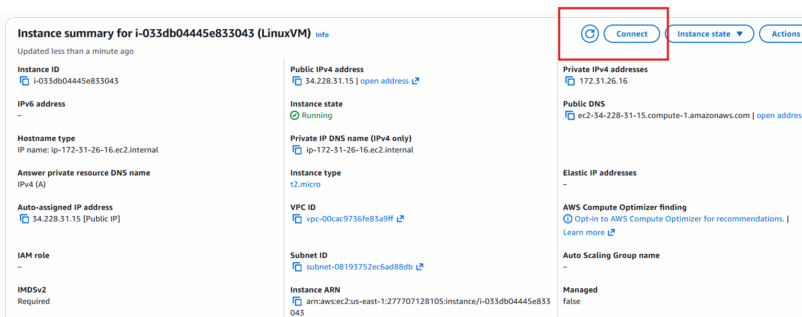

- click on connect and go to EC2 instance Connect tab

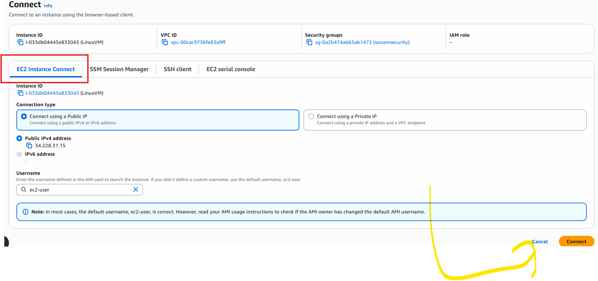

- click on connect button coming in the bottom.

- It will open in another tab and you can see default linux terminal in browser

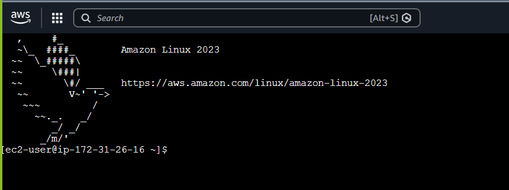

- in terminal you can execute below commands

```bash
sudo yum install httpd -y
sudo systemctl enable httpd
sudo systemctl start httpd
sudo systemctl status httpd 
# if its running
# you can check in browser by using your public IP
```

- make sure you type http://<your_Instance_public_ip>

- to edit code
- cd /var/www/html
- sudo nano index.html

```html                                                                                      
<!DOCTYPE html>
<html>
<head>
<title>Your Name</title>
</head>
<body>

<h1>Your Name</h1><hr/>
<p>I am Devops Expert.</p>

</body>
</html>
```