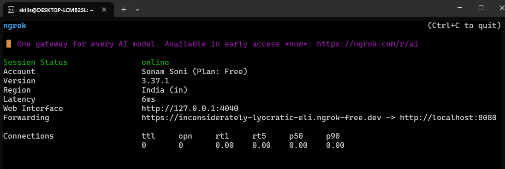
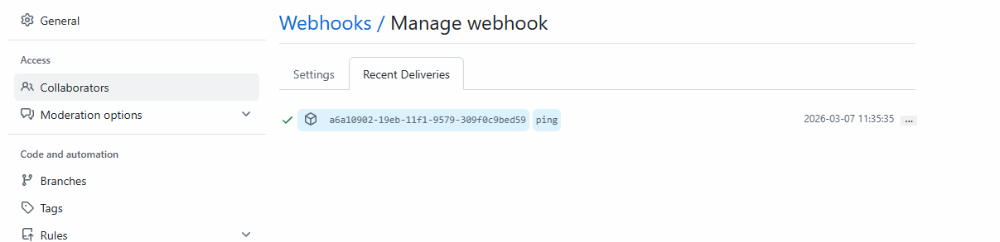

# Free Style Project

- jenkins Dashboard


- click on save
- click on Build Now


- click on no 1
- click on Console-output


## GitHub integration

- install plugins in Jenkins
- jenkins -> manage jenkins -> plugins -> available plugins
- Git, GitHub, Github Integration (install)

## Cred management

- go to github -> settings -> developer settings -> Personal Access Token 
- classic token
- give permissions: repo, workflow, admin:repo_hook

- generate Token

**Jenkins Credentials**
- jenkins - manage jenkins- credentials - add cred - username with passwords
- github-username, token in password
- id, descr - github-credentials
- save

### Create Free Style Project

- new Item -> project name - free style project - ok
- give description -> discard build
- scroll down to source code management and select Git


- save your Job

**as jenkins running on lcaolhost we will use ngrok to expose jenkins**

[Create Account on NgRok](https://dashboard.ngrok.com/signup)
- join with google
- choose developer
- choose as student
- once accountb created successfully your can see one token to set auth from your system

```bash
# install ngrok 
curl -sSL https://ngrok-agent.s3.amazonaws.com/ngrok.asc \
  | sudo tee /etc/apt/trusted.gpg.d/ngrok.asc >/dev/null \
  && echo "deb https://ngrok-agent.s3.amazonaws.com bookworm main" \
  | sudo tee /etc/apt/sources.list.d/ngrok.list \
  && sudo apt update \
  && sudo apt install ngrok

ngrok config add-authtoken <your_token_which_visible_browser>

ngrok http 8080

```


## Configure Webhook in Repository


- https://ngrok_generated_url/github-webhook/



- If Ping done success then try to push something on repo

- it automatically triggers build for jenkins project and you can see build started.

### Schedule

- * * * * *
- 1* - minutes [0-59]
- 2* - Hour [0-23]
- 3* - Day of Month [1-31]
- 4* - Month [1-12]
- 5* - Day of Week (0-7) [0-7 both sunday]

- 30 14 * * * [everyday at 2:30]

**While working with jenkins we use H**

- jenkins Hash value(spread jobs to reduce server load)
- H 2 * * * [daily at 2 AM]
- H/5 * * * * [every 5 minutes]