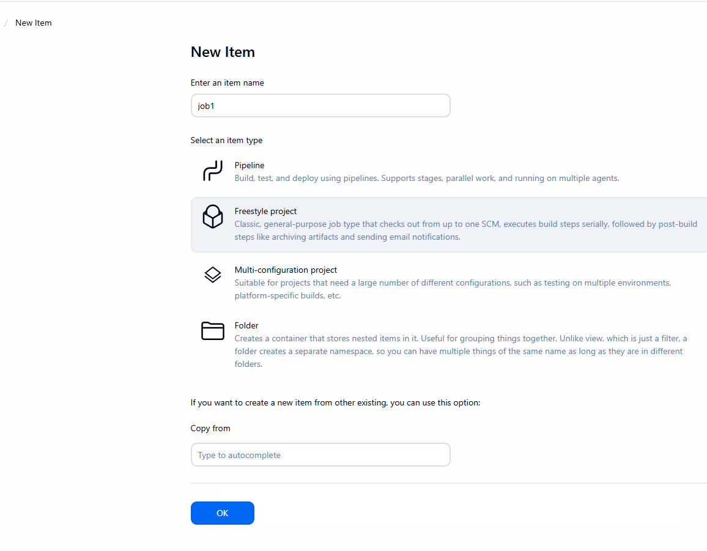
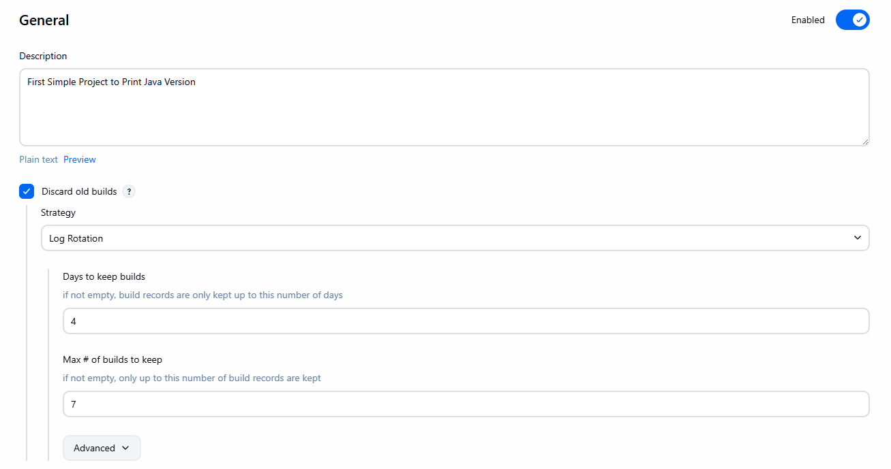
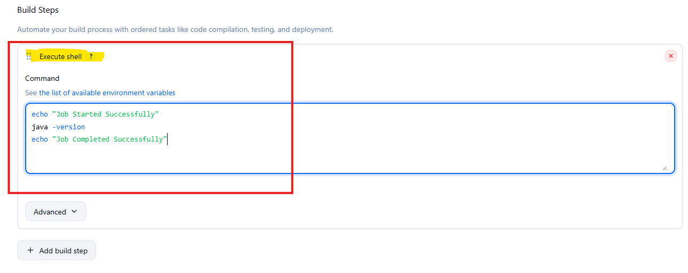
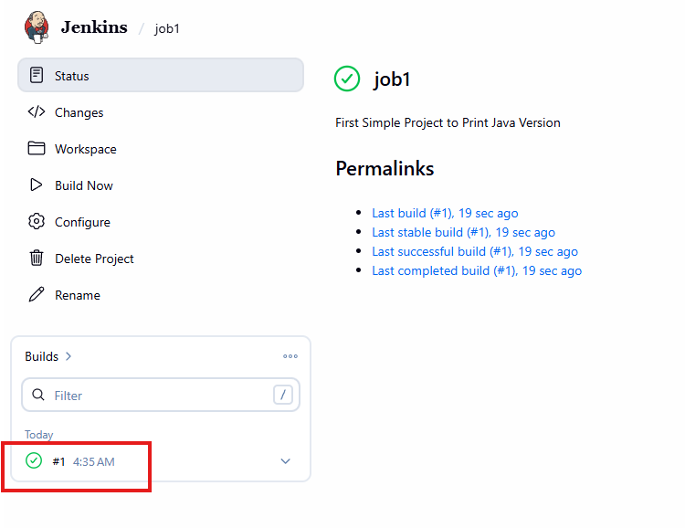
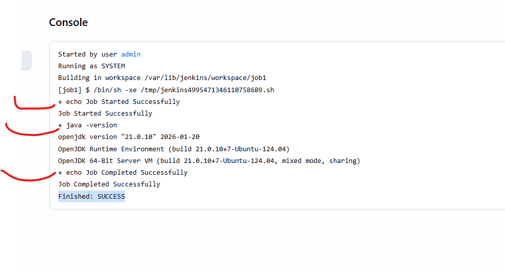
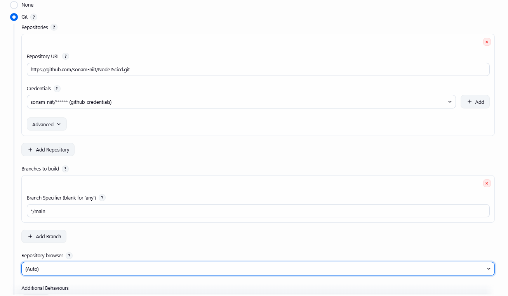
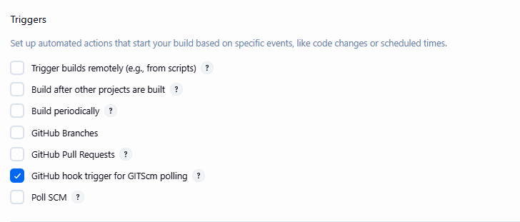
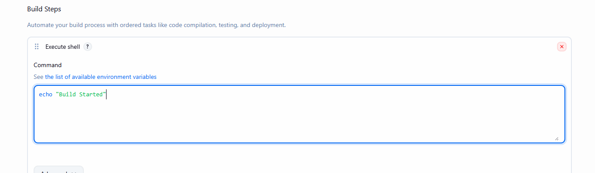
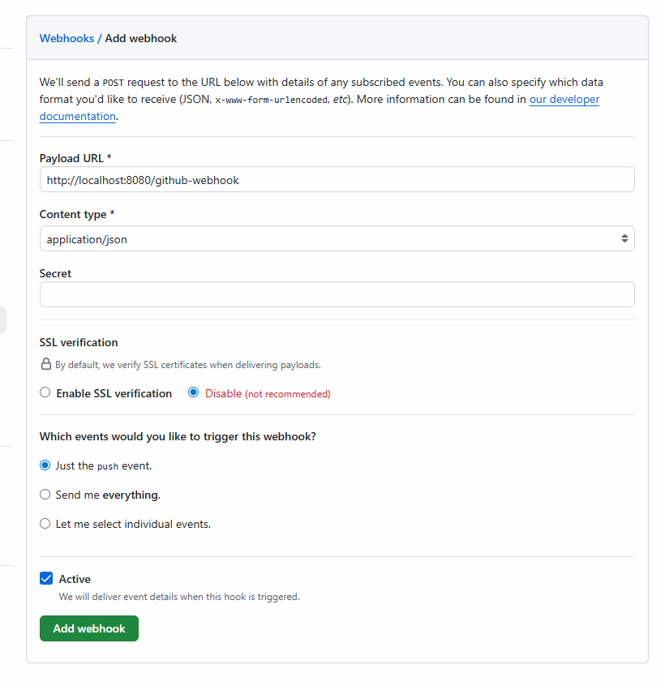

# Free Style Project

- jenkins Dashboard

- click on save
- click on Build Now

- click on no 1
- click on Console-output

## GitHub integration

- install plugins in Jenkins
- jenkins -> manage jenkins -> plugins -> available plugins
- Git, GitHub, Github Integration (install)

## Cred management

- go to github -> settings -> developer settings -> Personal Access Token 
- classic token
- give permissions: repo, workflow, admin:repo_hook

- generate Token

**Jenkins Credentials**
- jenkins - manage jenkins- credentials - add cred - username with passwords
- github-username, token in password
- id, descr - github-credentials
- save

### Create Free Style Project

- new Item -> project name - free style project - ok
- give description -> discard build
- scroll down to source code management and select Git

- save your Job

## Configure Webhook in Repository

