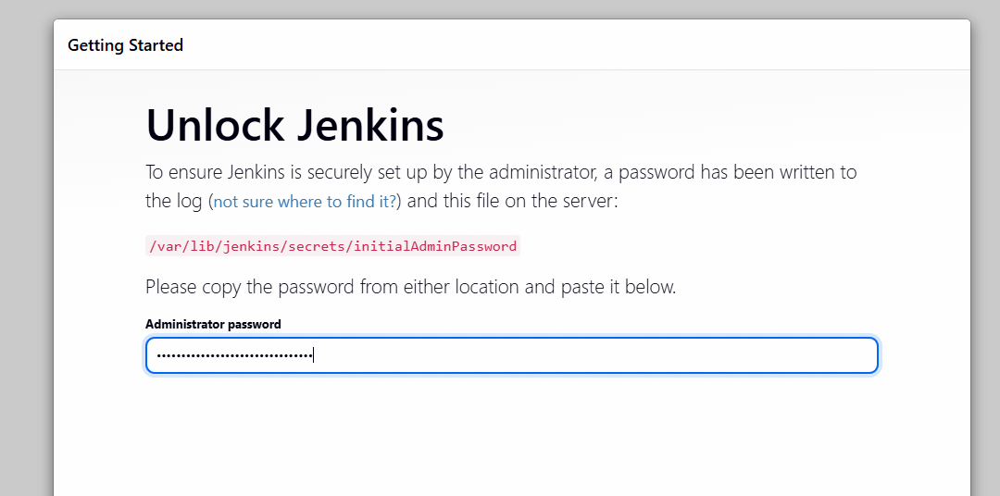
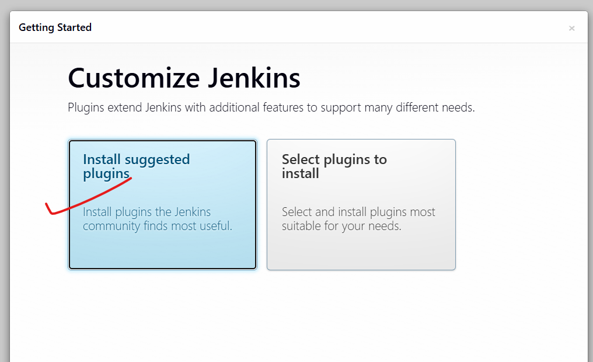
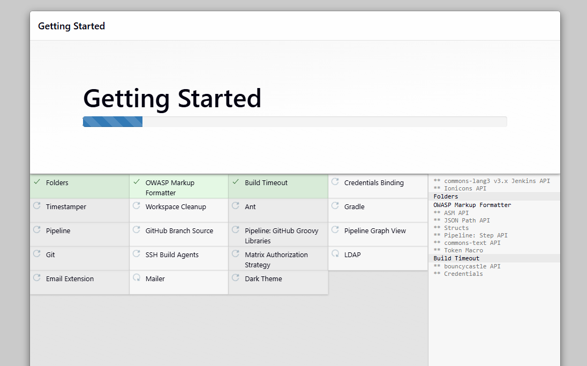
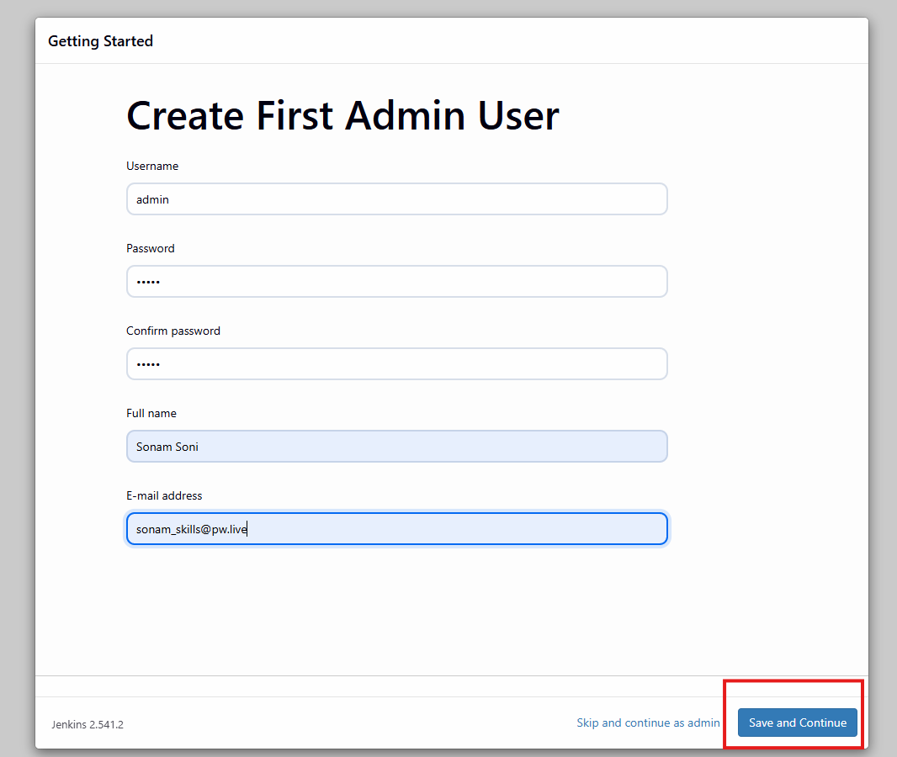
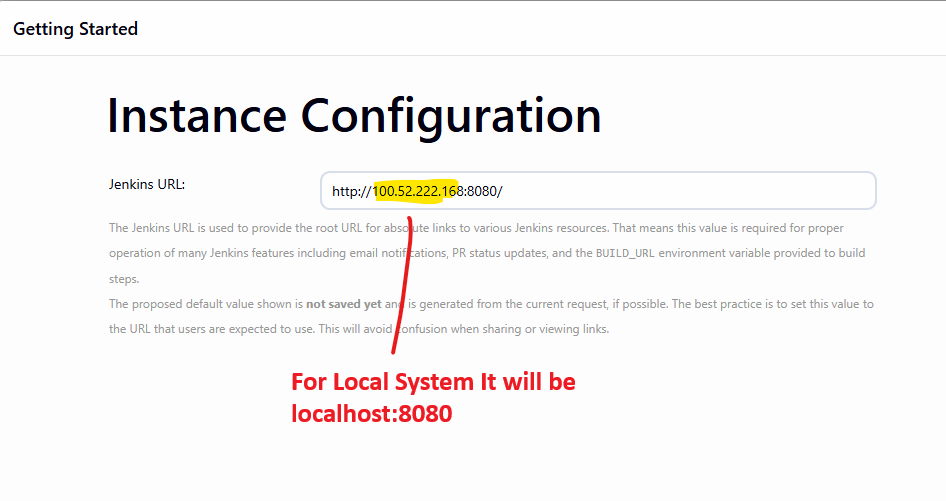
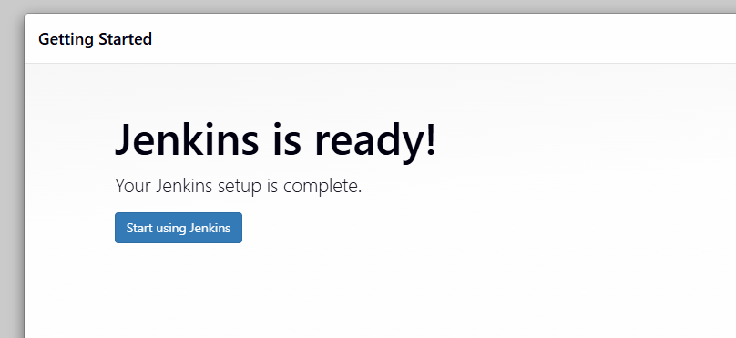
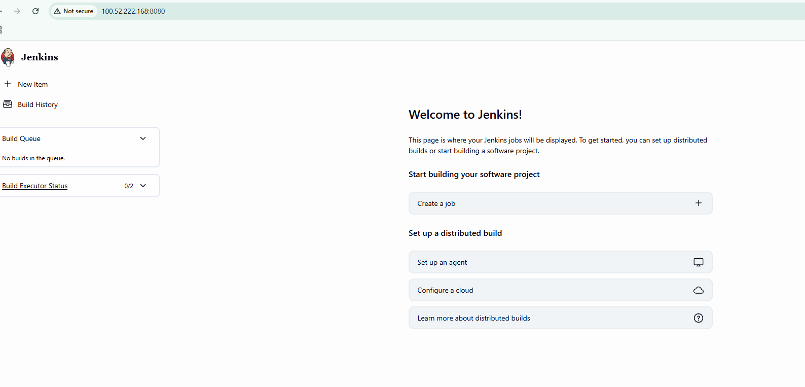

# Jenkins Installation

[Reference Link](https://www.jenkins.io/doc/book/installing/linux/)

### to work with jenkins, install Java

```bash
sudo apt update
sudo apt install fontconfig openjdk-21-jre
java -version
```
### Install Jenkins

```bash
sudo wget -O /etc/apt/keyrings/jenkins-keyring.asc \
  https://pkg.jenkins.io/debian-stable/jenkins.io-2026.key
echo "deb [signed-by=/etc/apt/keyrings/jenkins-keyring.asc]" \
  https://pkg.jenkins.io/debian-stable binary/ | sudo tee \
  /etc/apt/sources.list.d/jenkins.list > /dev/null
sudo apt update
sudo apt install jenkins
```

### start Jenkins

```bash
sudo systemctl enable jenkins # Jenkins service to start at boot 
sudo systemctl start jenkins # start if you stopped manually
sudo systemctl status jenkins # check status

sudo cat /var/lib/jenkins/secrets/initialAdminPassword
# copy initial Password
```

- access localhost:8080 in browser





- wait untill all plugins will get installed.







- click on Save and Finish



- Start Using Jenkins


