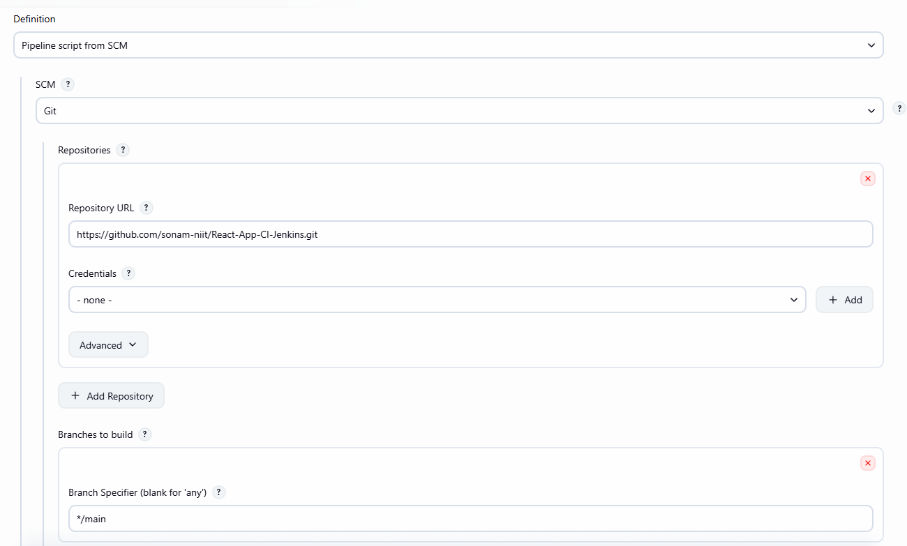
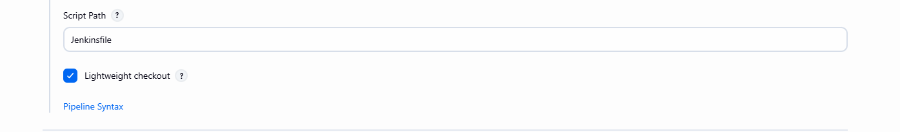

# How to use Jenkins File in project

- create a file without any extension and name it Jenkinsfile
- you can push it to your project

- create pipeline
- select pipeline from scm

- save and then build now

## To work with Nodejs

- install Nodejs plugin

- configure nodeJS tool
- manage jenkins -> tools -> scroll last -> NodejS installation (similar like maven) -> give name (NodeJS) - install automatically select version 22

- save

- build project