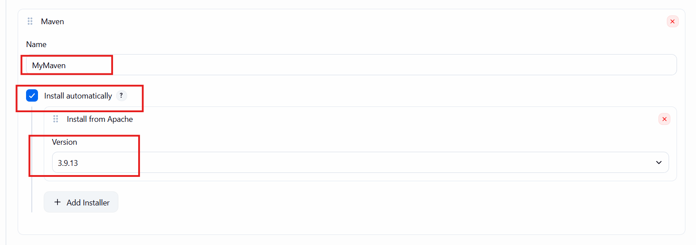

# pipelines in CI

- Jenkins Pipeline is a way to define your entire CI/CD process
- we can create pipeline inside jenkins / inside project
- if its inside the project the file name is Jenkinsfile

## Why to use

- more stable than free style projects
- pipelines as code, so we can easily review
- write complex CI/CD workflows
- Better for the DevOps automation.

## 2 Types

1. Declarative Pipeline
    + most common and easy
    + structured with simple syntax

```groovy
pipeline {
    agent any

    stages {
        stage('Build') {
            steps {
                echo 'Build Successful'
            }
        }
        stage('Test') {
            steps {
                echo 'Test Executed Successfully'
            }
        }
        stage('Deploy') {
            steps {
                echo 'App Deployed'
            }
        }
    }
}
```

- Go to Jenkins Dashboard -> name (pipeline-demo)
- select pipeline - click on OK
- give description
- config discard builds: no of days(7), min build(10)
- scroll down to last and in pipeline script from right hand side dropdown 
- select HelloWord simple pipeline
- update code and click on Build Now.
- check output console stage view 
- steps execution.

## Create pipeline for Java Project

- [Java Project](https://github.com/sonam-niit/SampleJavaMevan-Jenkins.git)
- project is having code files and test cases
- it maven project so for building project we will use maven tool

*Configure Maven in Jenkins*

- go to manage jenkins -> tools -> scroll down -> Maven installations
- click on Add maven ->



- you config name is MyMaven we will use the same in pipeline

```groovy
pipeline {
    agent any
    tools {
        maven "MyMaven"
    }
    stages {
        stage('Checkout Code') {
            steps {
                echo 'Checking out repository'
                git branch: 'main', url: 'https://github.com/sonam-niit/SampleJavaMevan-Jenkins.git'
            }
        }
        stage('Build') {
            steps {
                echo 'Creating Jar file'
                sh 'mvn clean package'
            }
        }
        stage('Test') {
            steps {
                echo 'Executing Tests'
                sh 'mvn test'
            }
        }
    }
}

```