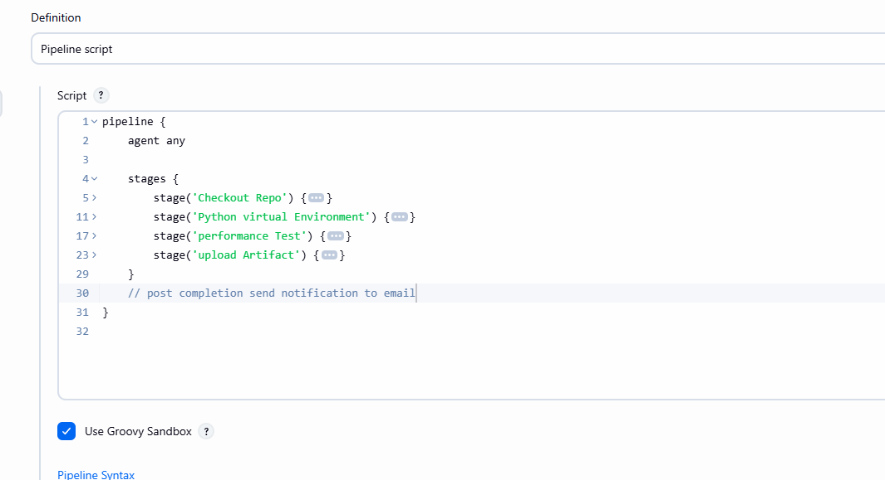

# Performance Test in jenkins

- create Jenkins Pipeline 

- start jenkins / check status of jenkins its running
- dashboard -> new Item -> create pipeline
- Pipeline Script place
- checkout repo
- setup virtual environment to install dependencies
- start/run application in backgroud
- run locust test

- here you are running everything locally in case if you are getting any connectivity error then in code file replace 0.0.0.0 with 127.0.0.1 (localhost)

- also generate reports
- upload them as artifact.

# use Same Jmeter project

- created last session
- generate report
