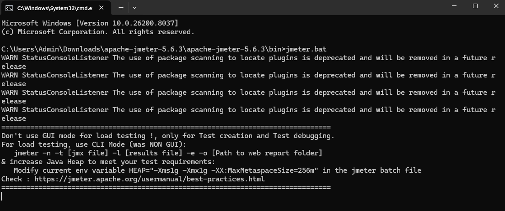
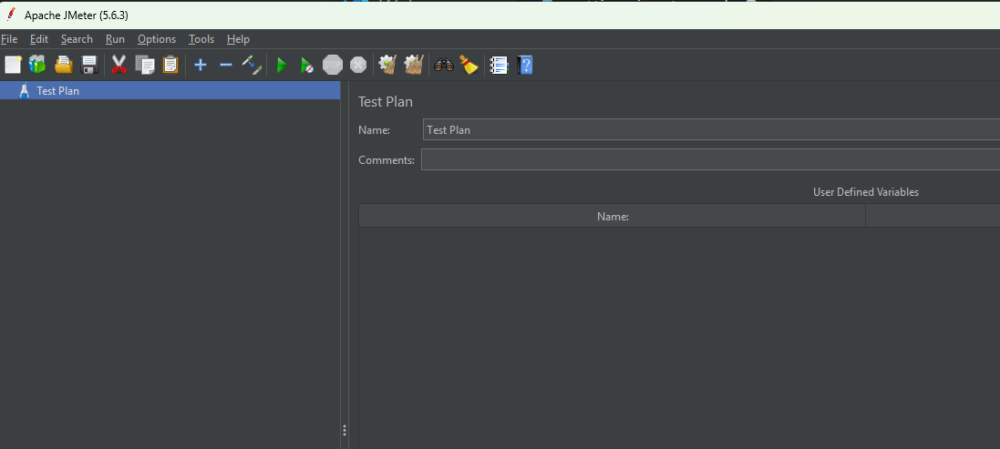
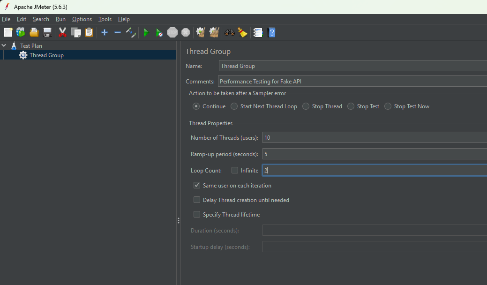
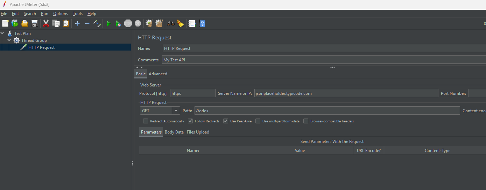
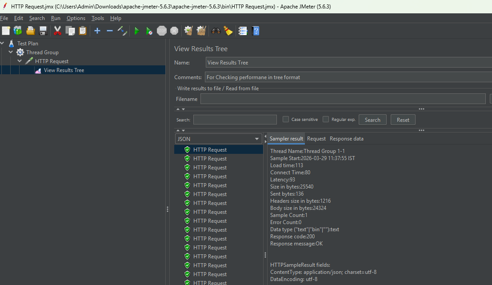
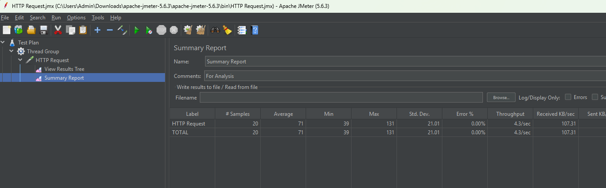

# setting up Jmeter

- Jmeter is Java based tool
- to run Jmeter we need to download JDK

## Download JDK

[Download JDK](https://www.oracle.com/in/java/technologies/downloads/#jdk21-windows)

- follow the default installation steps 
- once installed check version
- java -version

## Download JMeter

[Download Link](https://jmeter.apache.org/download_jmeter.cgi)

- download from binaries tar or zip any one
- extract
- open the folder for Jmeter
- open bin forlder in cmd / terminal
- for windows run jmeter.bat file for linux/mac run jmeter.sh

- jmeter will start

- make sure your terminal should not close, otherwise Jmeter will stop working

## Implement Performance Testing

- right click on test plan -> add -> threads(User) -> Thread group

- right click on thread-group -> add -> sampler -> HTTP request

- click on start (green) button
- it will ask you to save your jmeter file, you can it on default location

- to see result we have to configure result tree

- right click on HTTP req -> Add -> listener -> View Result Tree

- click on start button and see request send
- change format from text->JSON
- click on request check response data as well

*Here we actually triggered API with 10 users 2 req by each user in 5sec interval*

## Generating Summary report

- right click on http req -> add - sampler - summary report

- add comments and click on start

**you can also try some differen Fake API or some other links and test the performance of Application using JMETERE**