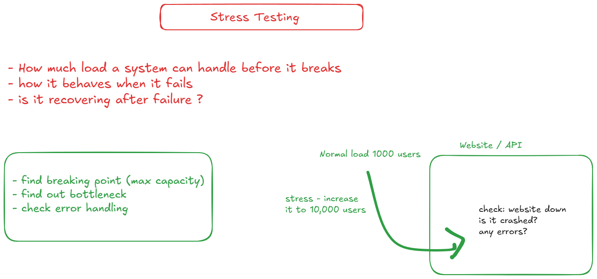
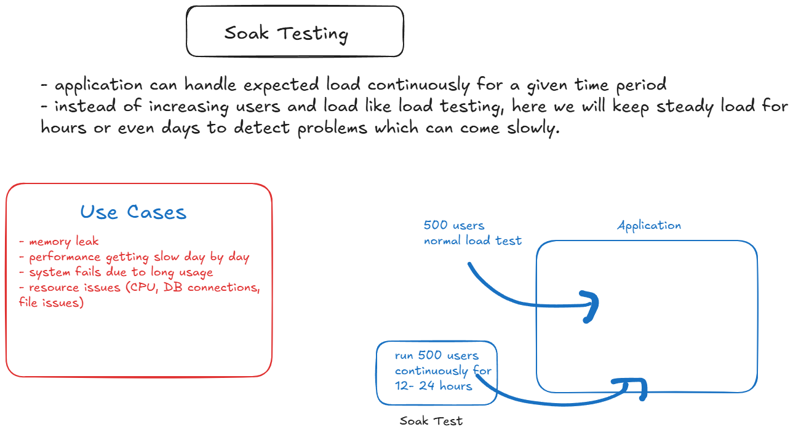
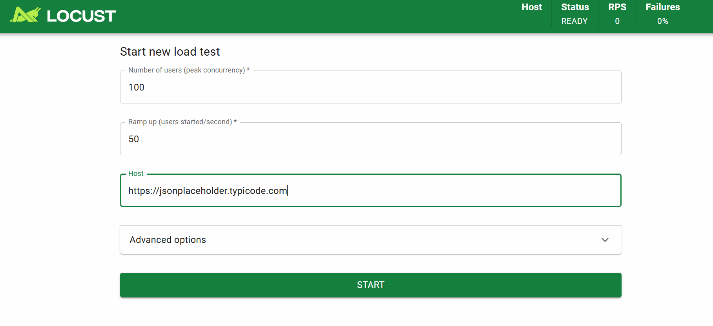

# Stress Testing

# Soak Testing

# Stress Tetsing using Locust

- pipenv install locust
- pipenv shell
- locust --version
- create locustfile.py
- locust -f locustfile.py

- access it in browser 
- localhost:8089

- lick on start button
- explore all tabs
- you can also click on stop to stop test
- generate reports as well

### Generating reports
- locust -f locustfile.py --headless -u 100 -r 10 -t 1m --csv=report --host=https://jsonplaceholder.typicode.com

- locust -f locustfile.py --headless -u 100 -r 10 -t 1m --host=https://jsonplaceholder.typicode.com --csv=report --html=report.html

