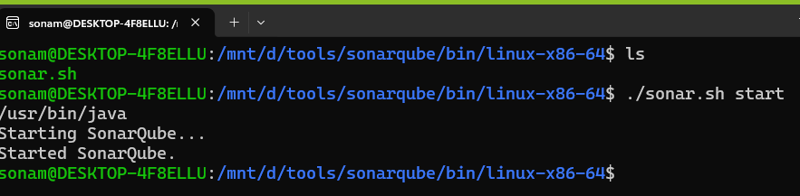
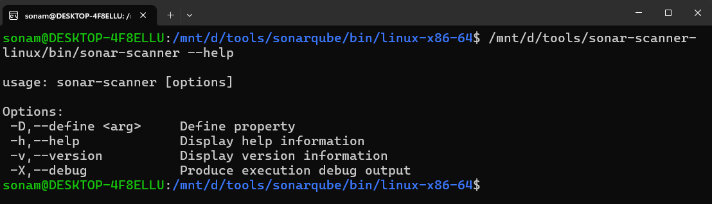

# SonarQube Setup

- to setup sonarqube we need JDK 17/21
- for few its running on 17 and for few its running on 21
- check JDK version in WSL

- java -version
- based on requirement you can install 21 or 17

```bash
sudo apt install openjdk-17-jdk -y
sudo apt install openjdk-21-jdk -y
java -version # if version is 17 dn't follow below steps

# swap from 17 to 21
sudo update-alternatives --config java
# you can see option like 1 for 17 and 2 for 21
# press 1 and enter, version  updated
java -version # you can verify
```

- Download SonarQube
[Link for Download](https://www.sonarsource.com/products/sonarqube/downloads/success-download-community-edition/)

- just for easy access you can extract sonarqube folder name it as simple sonarqube and then add it under c drive or d drive for direct access

- under the sonarqube folder open bin folder and check
- seperate folders for windows,mac and linux
- If you are running SonarQube from windows then run sonar.bat file
- for mac/linux you can run sonar.sh file



- check status using below commands

```bash
./sonar.sh start
./sonar.sh status
./sonar.sh console
# if its up wait for 4-5 minutes to up sonarqube and access in browser
# localhost:9000/
```

# let's Setup a project

- we are setting up node project
- create folder node-project
- move to the folder
- npm init -y (create package.json file)
- npm install express (install dependency)
- delete node-modules folder because we will do security testing without running our app.

- create index.js under project folder.
- add simple server code in index.js file

## to scan project we need sonar scanner

- [Download Sonar Scanner](https://docs.sonarsource.com/sonarqube-server/10.8/analyzing-source-code/scanners/sonarscanner#macos-and-linux)

- extract and keep it at same place where you have added your sonarqube



- Check Scanner Working fine or not
-  /mnt/d/tools/sonar-scanner-linux/bin/sonar-scanner --help

- Scanner working file we need to scan our project on sonarqube

- for scanning project go to project folder and create
file named sonar-project.properties at root level

- add codes shown here
- add below command in project

```bash
 /mnt/d/tools/sonar-scanner-linux/bin/sonar-scanner \
 -Dsonar.host.url=http://localhost:9000 \
 -Dsonar.token=<add_your_token>

```
- token you can generate from sonar Dashboard
- dashboard -> account -> myAccount -> security -> generate token -> Global Analysis token
- copy token and save it somewhere secretly.


