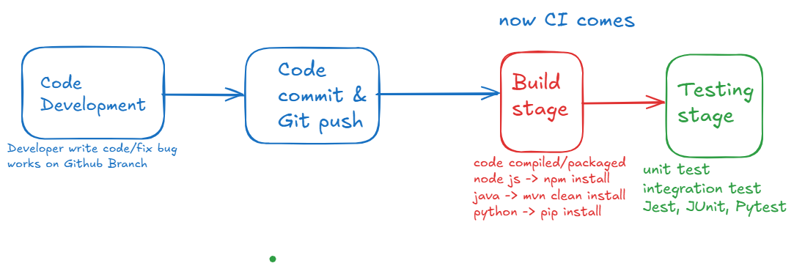
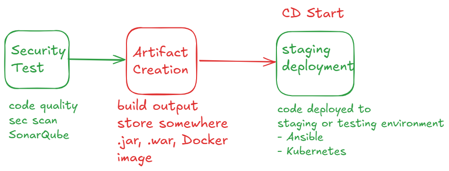
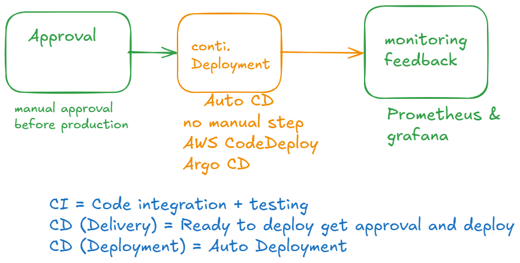

# CD continous Deployment







## Jenkins Pipeline for CD manual Approval

- create one jenkins pipeline 
- with default configuration
- all below script

```groovy
pipeline {
    agent any

    stages {
        stage('Build') {
            steps {
                echo 'Building done successfully'
            }
        }
        stage('Test') {
            steps {
                echo 'Test executed successfully'
            }
        }
        stage('Approval') {
            steps {
               timeout(time:15, unit:'MINUTES'){
                   input message: 'Do you want to approve the deployment?', ok:'yes'
               }
            }
        }
        stage('Deployment') {
            steps {
                echo 'App Deployed successfully'
            }
        }
    }
}

```

- save pipeline
- try to click on build now you can see approval option
- click yes to approve and abort to not approve

## Send notification email in pipeline

```groovy
pipeline {
    agent any

    stages {
        stage('Build') {
            steps {
                echo 'Building done successfully'
            }
        }
        stage('Test') {
            steps {
                echo 'Test executed successfully'
            }
        }
        stage('Email for Approval') {
            steps {
              mail to: 'sonam_skills@pw.live',
              subject: "Approval needed for production Deployment",
              body: """
              Build #${env.BUILD_NUMBER} is ready for approval
              click on the following link to approve
              ${env.BUILD_URL}
              
              Login and click "Proceed" in approval stage
              """
            }
        }
        stage('Approval') {
            steps {
               timeout(time:15, unit:'MINUTES'){
                   input message: 'Do you want to approve the deployment?', ok:'yes'
               }
            }
        }
        stage('Deployment') {
            steps {
                echo 'App Deployed successfully'
            }
        }
    }
}

```

- also make sure to configure email Notification in jenkins

- jenkins -> manage jenkins -> Email Notification
- check on use SMTP authentication
- SMTP server: smtp.gmail.com
- click on advanced
- give email id as username
- enter app password of your email:
    - myaccount.google.com
    - search for app password create one
     copy some where
- add that password
- check on use SSL
- SMTP port: 465