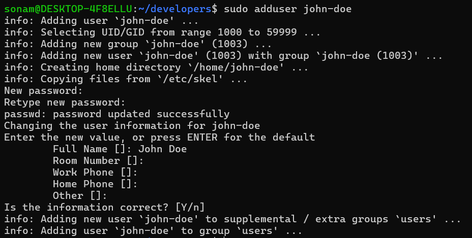
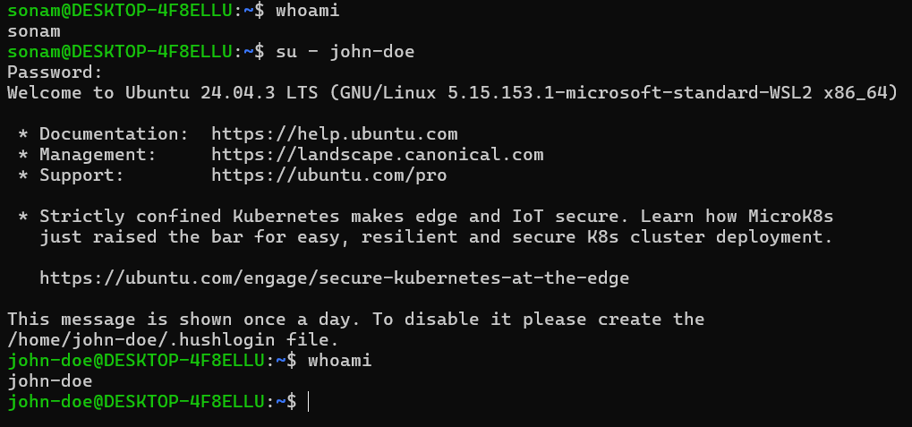

# User Management in Linux

1. User Creation
    - use command: sudo addusser john
    - create user named john
    - prompt for password so enter password
    - add user details and your user will be created.

2. List All Users
    - cat /etc/passwd
    - john-doe:x:1003:1003:John Doe,,,:/home/john-doe:/bin/bash

*Explanation: username:password:UID:GID:home_directory:shell*

3. Login With New User:

4. Check Users are in which Group:

    - groups john-doe

5. usermod: changing permission to existing User

    - sudo usermod -i john-doe dummyuser (change Username)
    - sudo usermod -aG sudo dummyuser (add dummy user to sudo group without removing from other groups)
    - sudo usermod -e 2026-12-31 dummyuser (set expiry)
    - sudo chage -l dummyuser (verify expiry)

6. Delete User:

    - sudo deluser dummyuser (delete Just User)
    - sudo deluser --remove-home dummyuser (remove user with home directory)