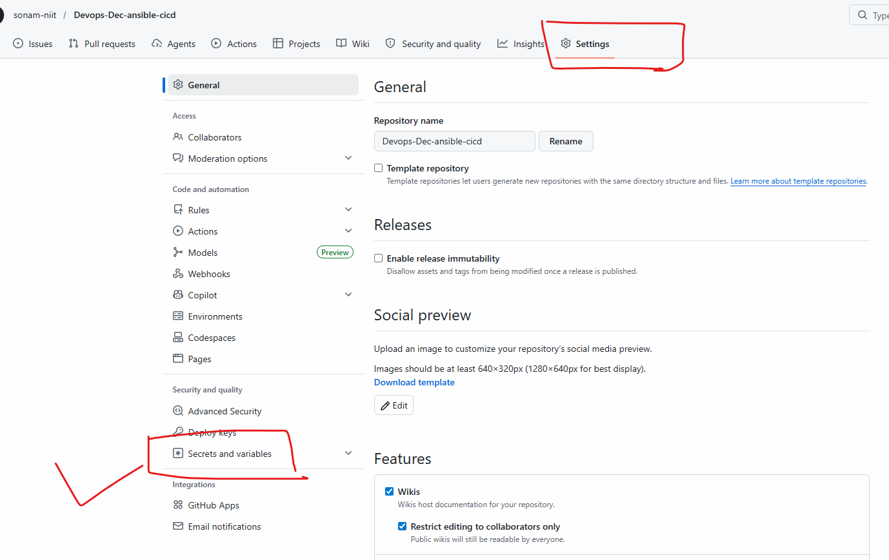
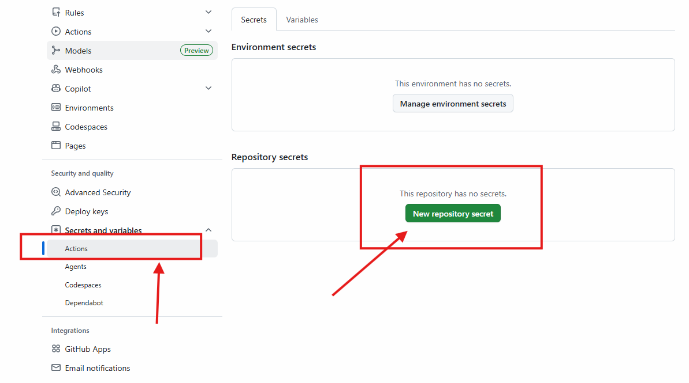
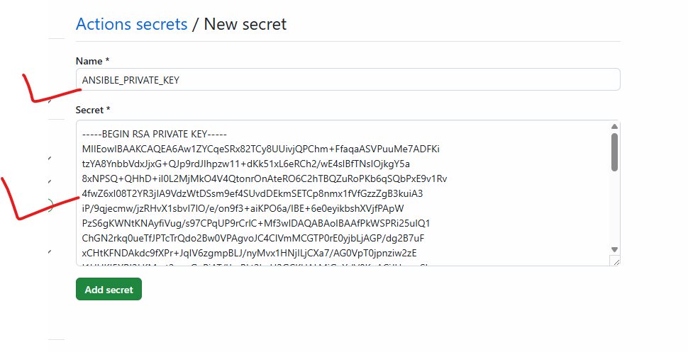
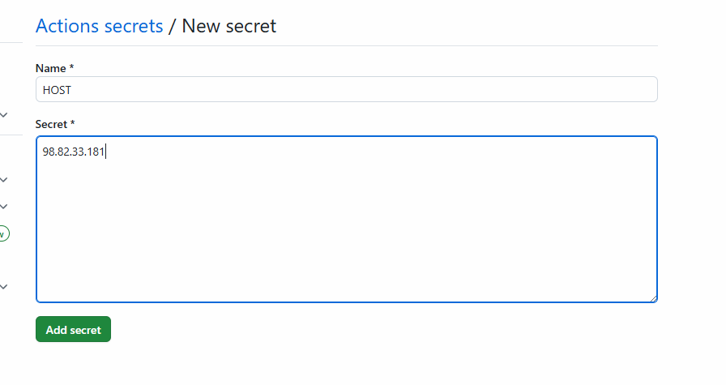
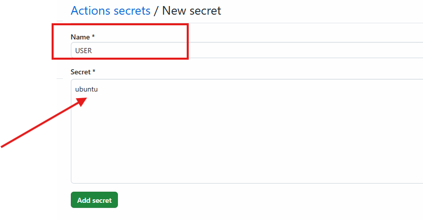
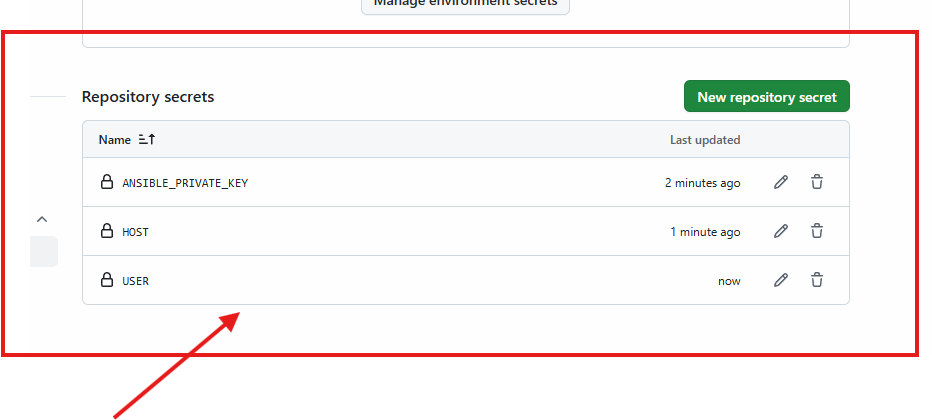
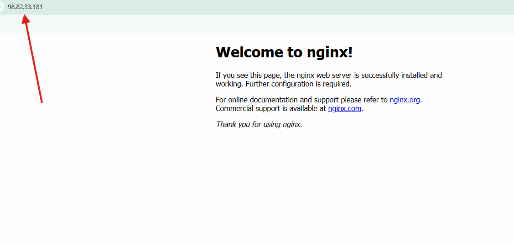
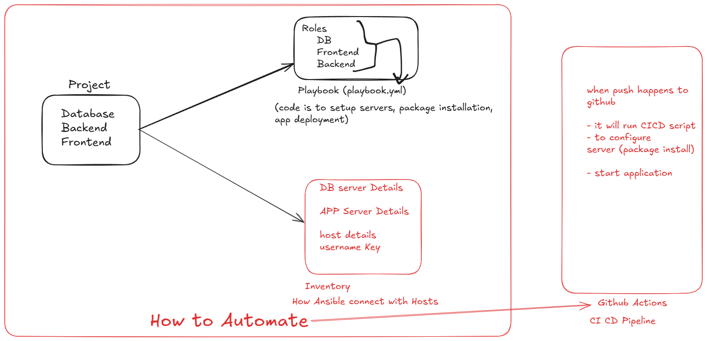

# Deploy Application Ansible + CICD pipeline using Github Actions

- create Seperate Project-folder (ansible-cicd)

## Configure Secrets

- click on actions, create secrets

- run this command from your Local system where the key stored
- cat ~/.ssh/pwskills.pem   (copy key)

- you can push code on Github So workflow will get executed.
- if its executed successfully
- nginx will started on your AWS instance, check in browser with public IP
- you can see default page of NGinx

*In your Security group port 80 must open to access output in browser*

- Refer Project Repository Link below
[Reference](https://github.com/sonam-niit/Devops-Dec-ansible-cicd.git)

