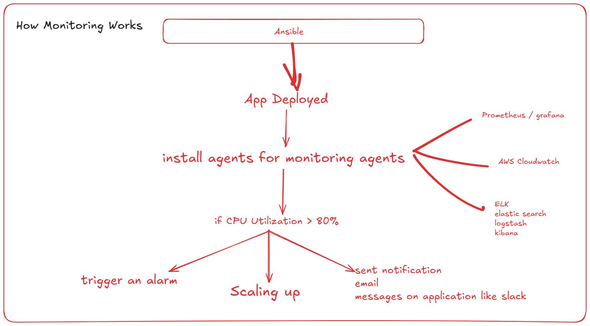

# we can use Ansible as IaC

- Infra as Code for creating resources
- like we can create Ec2 instance, Securituy groups, IAM users, S3 buckets etc

- how to create the same?

[Reference Link](https://docs.ansible.com/projects/ansible/latest/collections/amazon/aws/ec2_instance_module.html)

- before running playbook make sure AWS CLI is configured 
- aws sts get-caller-identity

- if its not configured (refer notes for session-29)
[Configure AWS CLI](https://github.com/sonam-niit/Devops-Dec-2026/blob/main/session-29-ansible-core/Dynamic-inventory.md)

- create playbooks - create-instance.yml

```yml
---
- name: Launch EC2 Instance
  hosts: localhost
  connection: localhost
  gather_facts: false

  tasks:
    - name: start an instance with a public IP address
      amazon.aws.ec2_instance:
        name: "public-compute-instance"
        key_name: "pwskills"
        instance_type: "t2.micro"
        security_group: "sonamvm"
        region: "us-east-1"
        image_id: "ami-091138d0f0d41ff90"
        tags:
          Environment: dev
      register: ec2_result

    - name: Output Instance ec2_result
      debug:
        var: ec2_result
```

- run playbook: ansible-playbook create-instance.yml
- if you want to use the values as an variables you cna create seperate file
- create folder named group_vars -> under this create all.yml file

```yml
aws_region: us-east-1
key_name: pwskills
ami_id: ami-091138d0f0d41ff90
instance_type: t2.micro
tag_name: dev-instance
security_group_name: sonamvm
environment: dev
```

- update playbook.yml
```yml
---
- name: Launch EC2 Instance
  hosts: localhost
  connection: localhost
  gather_facts: false

  vars_files:
    - group_vars/all.yml
    
  tasks:
    - name: start an instance with a public IP address
      amazon.aws.ec2_instance:
        name: "{{ tag_name }}"
        key_name: "{{ key_name }}"
        instance_type: "{{ instance_type }}"
        security_group: "{{ security_group_name }}"
        region: "{{ aws_region }}"
        image_id: "{{ ami_id }}"
        tags:
          Environment: "{{ environment }}"
      register: ec2_result

    - name: Output Instance ec2_result
      debug:
        var: ec2_result
```

- ansible-playbook playbooks/create-instance.yml
- also update terminate.yml and execute below command.
- ansible-playbook playbooks/terminate.yml

## How monitoring works in Ansible

