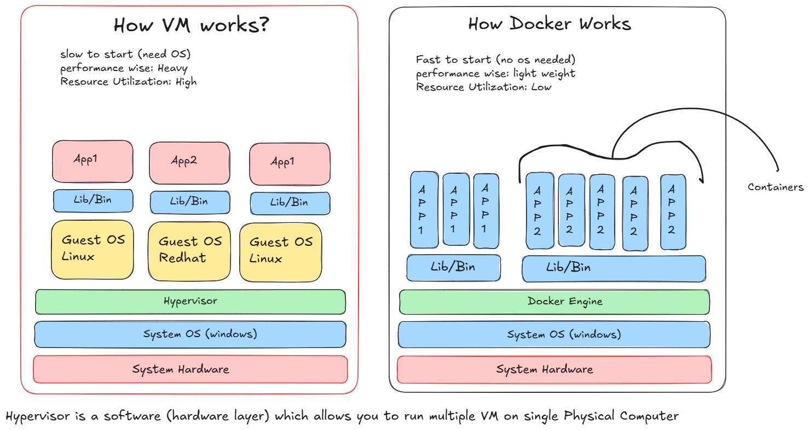
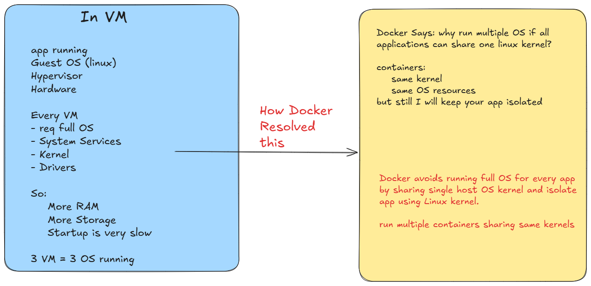
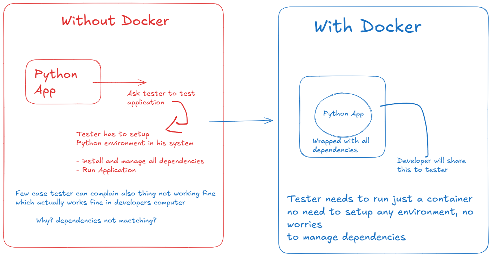

# Docker Fundamentals

## Vm vs Containers

## Benefits of Containers

## Benefits of Docker

## Docker Components

1. Docker Image:
    - Ready to execute blue print of application
    - it wraps all libraries, dependencies and configurations
    - ubuntu, python-3.11, flask, pytest
    - you just need to download as template and use it.
    - out project images we can create
    - but what if I want to use Python, Ubuntu, mysql etc..
    - this are inbuit images: where to see?
    - you can see all images on docker hub: https://hub.docker.com/
    - httpd demo: [HTTPD Image](https://hub.docker.com/_/httpd)
    - searh for any image and explore

2. Docker Container:
    - A running instance of image is container
    - image(template)- blue print
    - container: Running image