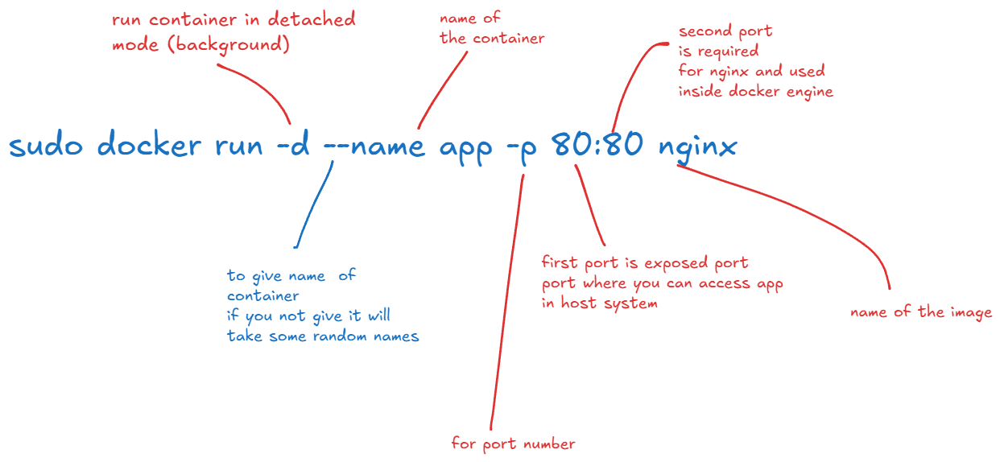

# Docker Installation

1. Set up Docker's apt repository.

```bash
# Add Docker's official GPG key:
sudo apt update
sudo apt install ca-certificates curl
sudo install -m 0755 -d /etc/apt/keyrings
sudo curl -fsSL https://download.docker.com/linux/ubuntu/gpg -o /etc/apt/keyrings/docker.asc
sudo chmod a+r /etc/apt/keyrings/docker.asc

# Add the repository to Apt sources:
sudo tee /etc/apt/sources.list.d/docker.sources <<EOF
Types: deb
URIs: https://download.docker.com/linux/ubuntu
Suites: $(. /etc/os-release && echo "${UBUNTU_CODENAME:-$VERSION_CODENAME}")
Components: stable
Architectures: $(dpkg --print-architecture)
Signed-By: /etc/apt/keyrings/docker.asc
EOF

sudo apt update
```

2. Install the Docker packages.

```bash
sudo apt install docker-ce docker-ce-cli containerd.io docker-buildx-plugin docker-compose-plugin -y

# once installation done, verify docker status
sudo systemctl status docker

# if it is not running run manually
sudo systemctl start docker

docker --version # to see version details
docker version # to see client server details
```

# Let's Pull and run images

```bash
sudo docker pull nginx
sudo docker images # to see pulled images

sudo docker pull hello-world
# to delete image
sudo docker rmi nginx

# docker container
sudo docker run hello-world
```

## what happens when you executes run command

1. The Docker client contacted the Docker daemon.
2. The Docker daemon pulled the "hello-world" image from the Docker Hub.(amd64) if not available locally
3. The Docker daemon created a new container from that image which runs the executable that produces the output you are currently reading.
4. The Docker daemon streamed that output to the Docker client, which sent it to your terminal.

## how to see containers

```bash
sudo docker ps # to see only running containers
sudo docker ps -a # to see running + exited containers
# when container stops it went into exit state
# to delete exited containers
sudo docker rm container_name # container name you can copy from prev command o/p
```

## Let's run nginx

```bash
sudo docker run -d --name app1 -p 80:80 nginx
# access on loclahost
sudo docker run -d --name app2 -p 9090:80 nginx
# access on localhost:9090

sudo docker ps
# if container up check in browser localhost
# you can see default page of nginx
sudo docker stop app1
sudo docker stop app2
# when you stop it goes exit state
sudo docker ps -a
#  to delete
sudo docker rm app1
sudo docker rm app2
#  noramally you can't remove the container which is running
# you need to stop first and remove, you can remove it forcefully
sudo docker rm -f app
# this is not suggested in production
```

