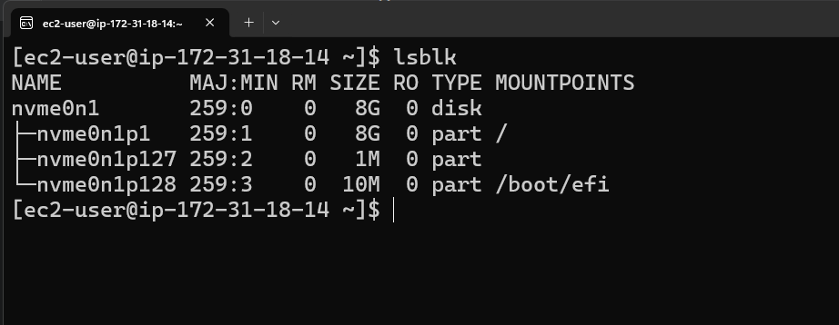
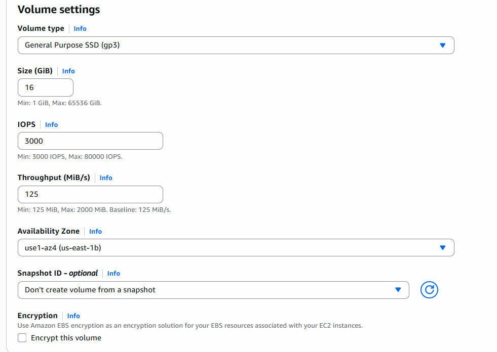
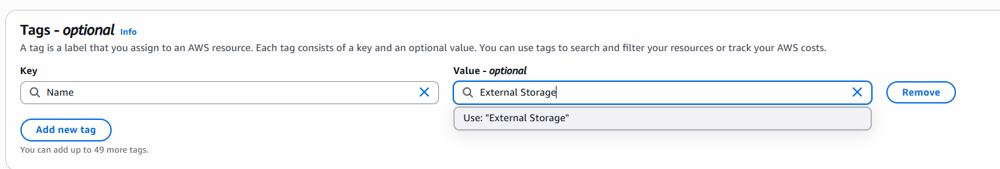
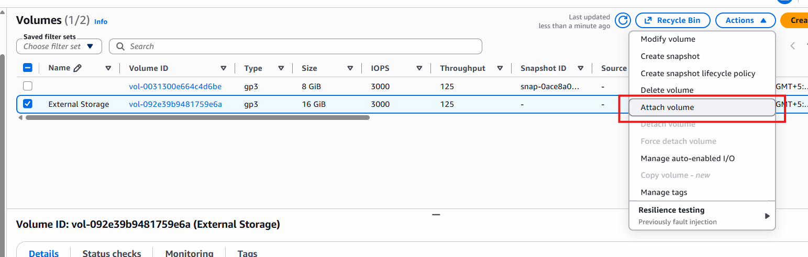
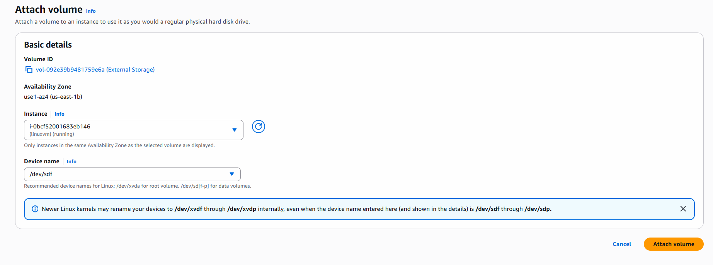
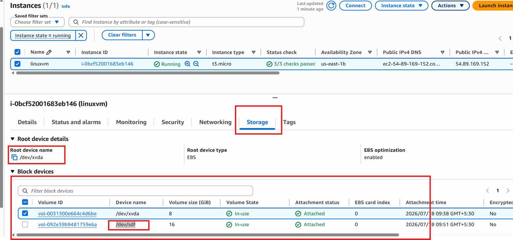

# EBS (Elastic Block Store)

- Block Level Storage
- to attach extra Space to instance. (usage)
- used for Backup persistence storage.

## step by step execution

- create instance Linux
- check instance zone (once its created - us-east-1b)
- Let's check storage details
- connect with instance.
- run lsblk command




## Attach Extra Volume to this instance

- create new volume
- click EBS > Volume > create new
- make sure the volume is under the same zone where your instance is, otherwise you can't attach them.





- create volume.
- once your volume is ready refresh it, select and actions - attach





- go to your instance -> refresh -> open and click on storage and check



- again go to connected instance and run lsblk command and see external volume attached.

```bash
sudo mkfs -t ext4 /dev/sdf # format volume to ext4 File System
mkdir sonam # cretae folder to mount
sudo mount /dev/sdf sonam
# verify
lsblk
#unmount
sudo umount /dev/sdf
lablk # verify unmounted or not
```

### Practice Task

- Create Snapshot (Backup)
- select your volume (extra storage)
- give description
- tag: Name: backup_extra_volume

## Restore Volume from Backup

- Instance Deleted and now you cretaed new instance and you want this volume as backup.
- create volume, select snapshot
- give details created
- attach this volume to instance.

## Detach and Delet Volume

- select volume, action -> Detach -> refresh
- select volume action -> delete