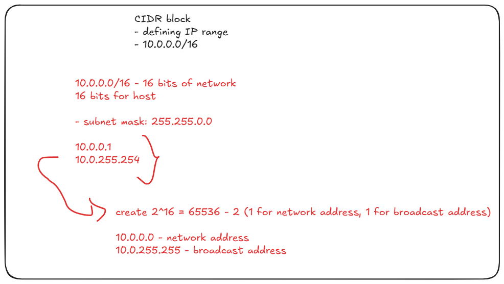
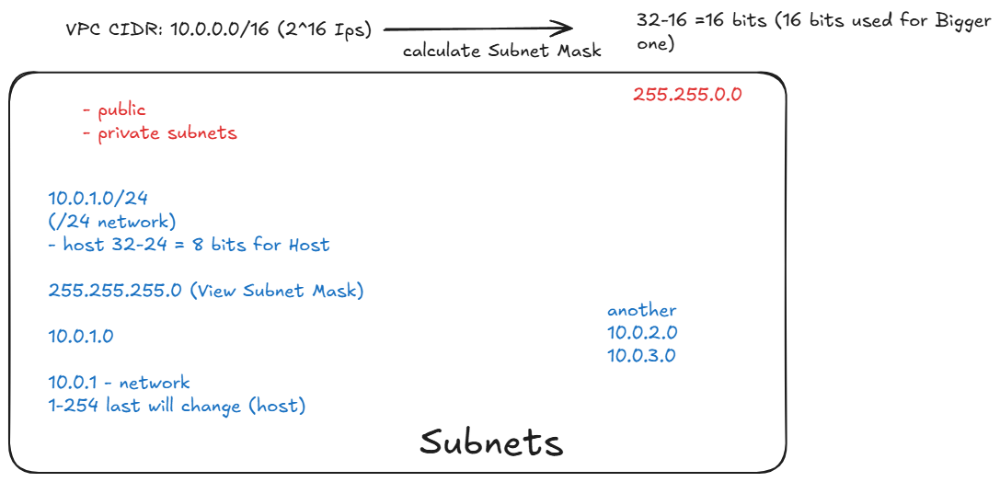
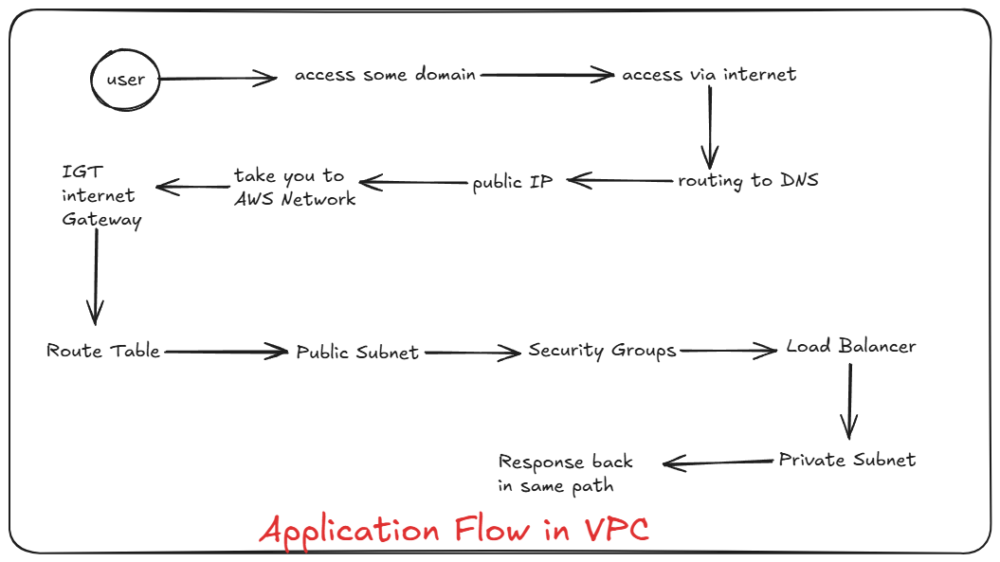
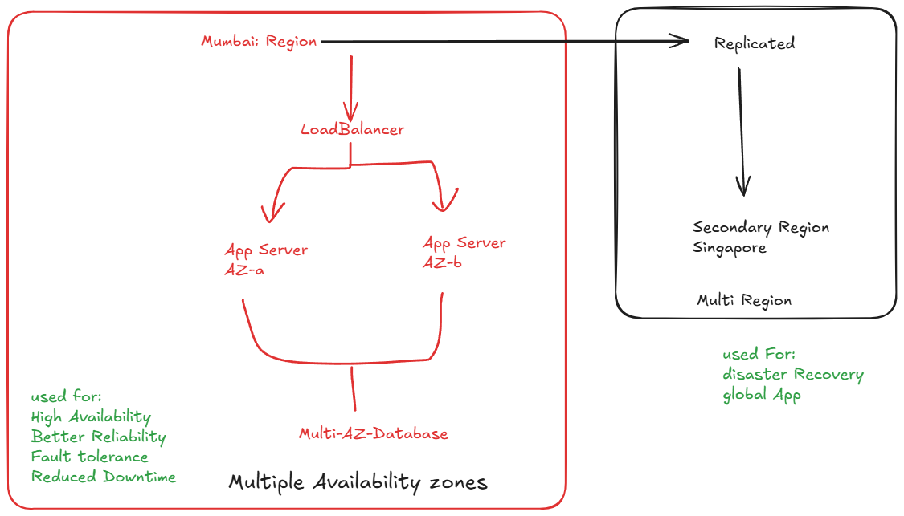

# VPC (Virtual Private Cloud)

- owns private cloud (data center) created inside AWS
- isolate network to launch EC2, RDS resources.

1. CIDR block

2. Subnets:
    - small networks inside VPC
    - 2 Types of Subnets
    - Private:
      - no direct internet connection
      - connected internally for DB and Backend servers
    - public
      - has internet
      - used for load balancers
    - 10.0.1.0 /24 ==> Public
    - 10.0.2.0 /24 ==> Private

3. Routing Table:
   - controls the route traffic
4. Internet Gateway:
   - allows communication between vpc and internet
   - attached to vpc
  
- Application Flow in VPC

## Multi Region and Multi AZ

