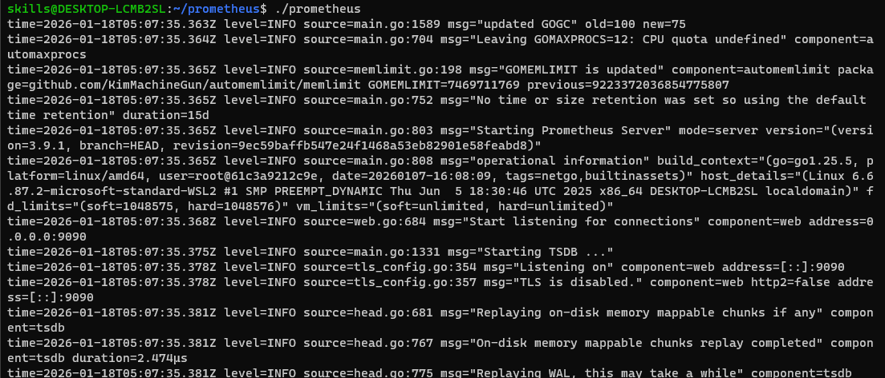
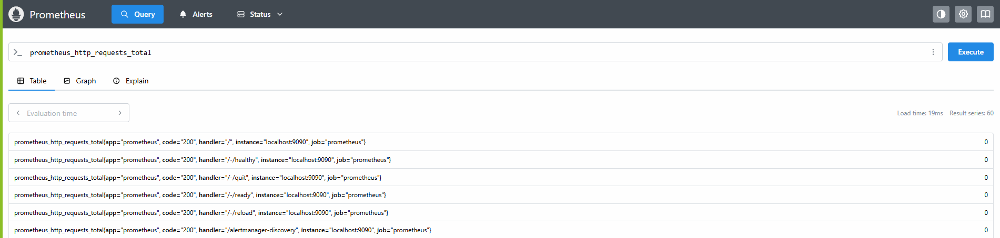
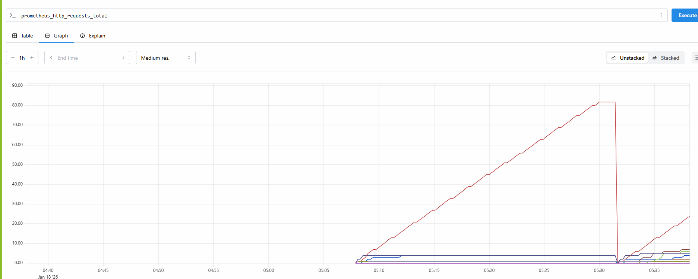
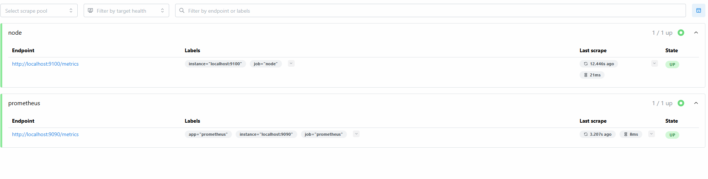

# Prometheus

- Powerfull Monitoring Tool

## Setup

[Download From this link](https://prometheus.io/download/)

- download .tar file for linux
- extract to downloads folder only
- go to wsl

```bash
mv /mnt/c/Users/Admin/Downloads/prometheus-3.9.1.linux-amd64 prometheus
# moving entire folder to prometheus folder under wsl /home/skills

cd prometheus
ls # check files

# edit prometheus.yml
nano prometheus.yml
# add below code
```

```yml
# my global config
global:
  scrape_interval: 15s

scrape_configs:

  - job_name: "prometheus"

    static_configs:
      - targets: ["localhost:9090"]
        labels:
          app: "prometheus"
```

- save file ctrl+o enter ctrl+x
- now let's start prometheus

```bash
./prometheus
```

- access it in browser 


[Prometheus Dashboard](http://localhost:9090)

[Check No of targets running](http://localhost:9090)

### Monitoring





- type in query and check

- process_cpu_seconds_total
- process_virtual_memory_bytes

## Setting up a Node Exporter to connect data in Prometheus

[Reference Link](https://prometheus.io/docs/guides/node-exporter/)

- keep above wsl running as it is and open another wsl
- in new wsl run below command to download and start node-exporter

```bash
wget https://github.com/prometheus/node_exporter/releases/download/v1.10.2/node_exporter-1.10.2.linux-amd64.tar.gz
tar xvfz node_exporter-1.10.2.linux-amd64.tar.gz
cd node_exporter-1.10.2.linux-amd64
./node_exporter

# if its started check in browser localhost:9100/metrics
```

- now go to old wsl do ctrl+c to terminate prometheus
- edit prometheus.yml to add node exporter target

```bash
nano prometheus.yml
```
- add below code
```bash
# my global config
global:
  scrape_interval: 15s

scrape_configs:

  - job_name: "prometheus"

    static_configs:
      - targets: ["localhost:9090"]
        labels:
          app: "prometheus"


  - job_name: node
    static_configs:
      - targets: ['localhost:9100']
```
- save it
- again start prometheus

```bash
./prometheus
```

- check targets localhost:9090/targets



*If your port 9090 busy start on diffrent port ./prometheus --web.listen-address=":9091"*

