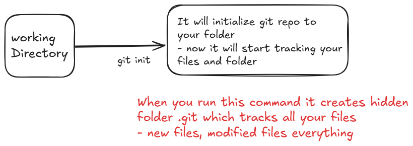
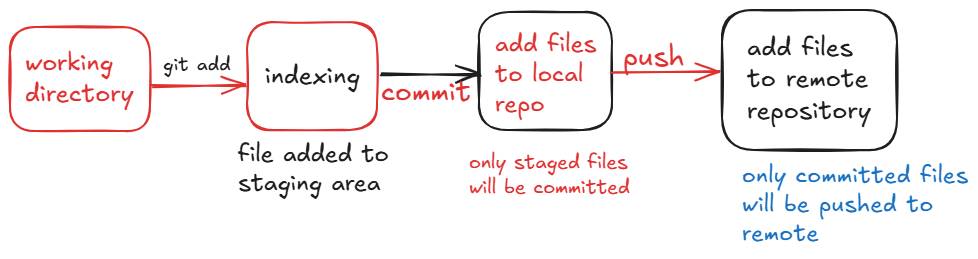
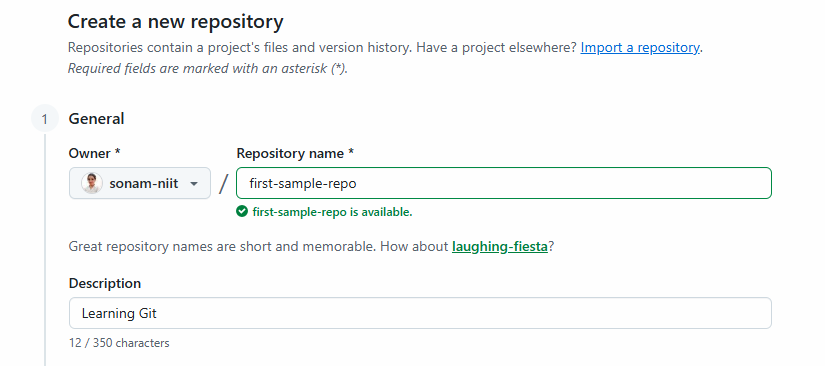
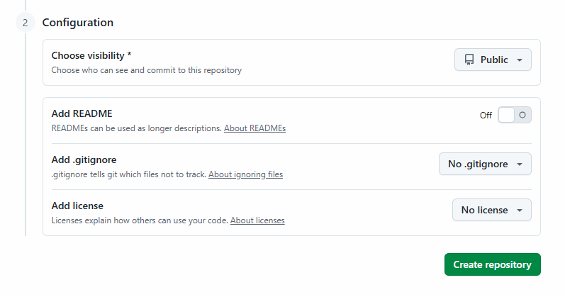
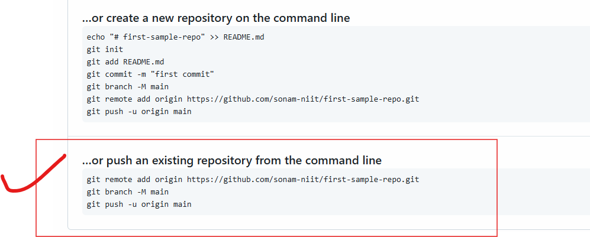
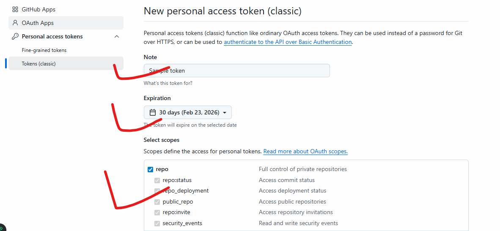

# Version Control System

1. RCS: Revision Control System - old & simple
    - File Based Version Control
    - Works on files not on full projects
    - mostly used for one machine

    - e.g. let's say created c program file like app.c
    - then I executed command: ci app.c
    - This command check file, create a file app.c,v
    - RCS will store all versions in this v file

    **Limitations**
    - No tea collob
    - no remote repo
    - not used now a days

2. SVN (Sub version): Centralized Version Control

    - Project Based Version Conrol
    - used by teams
    - having central server (repository)

    - e.g. A team builing a website
    - execute command: svb checkout <repolink>
    - svn commit -m "Login file created"
    - see log: svn log

    **Real Time analogy**
    - Google Docs
    - central doc, everyone can sync it

3. Git: Distributed Version Control System
    - more powerfull
    - industry standard



4. Git Analogy

    - You are a developer working on login feature
    - Morning:
        - i modified: login.html, auth.js
        - i can see only these changes what i made

    - git add login.html auth.js
        - I want these files to go in my update
        - I finished code writing and kept those files ready to submit

    - git commit -m "Added user login validation"
        - I said this is my official work record for today
        - this is going to save safely in my system
        - still your team can't see it.

    - git push:
        - Team, my work is ready you can pull and check.



**Notes**

- Add -> Select
- Commit -> Save
- Push -> Share

## To work with this we need to install one Software 

    - Thats Git
[Download Link](https://git-scm.com/install/windows)

- Once installed successfully run below command
- git --version [you can see the version]

```bash
sudo apt update && sudo apt install git
git --version
```

**Demo**
- Open Git Bash (windows) or wsl (for ubuntu) or terminal (mac)
```bash
mkdir demo-git
cd demo-git
ls -a # here you can't see any files
git init # initialize repo
ls -a # you can see .git hidden folder

echo "Example of Git" > file.txt
ls 
git status # you can see file untracked
git add file.txt # file staged
git status
git rm --cached file.txt # to unstage
git status
# again stage and check status
git add file.txt
git status
echo "New Line Added" >> file.txt # file modification
git status # you can see file modified
# if you wnat to stage those changes as well then again stage
git add file.txt

# git commit -m "File Creation Done" 
# this command won't work until you do configuration of git
```

### What is Git Config

- To do configuration we need github account
- [Github.com](https://github.com/)
- Create Account

- Git Config  is used to get, set and manage Git Configurations settings like setting username, email, aliases, editor and more.

- Git Has 3 configuration levels

    1. System: appied to all system users - for admin, sonam, alex etc  users in system
    2. Global: applied to your user - only for sonam
    3. local: applied to single repo - only for perticular folder

- Priority: Local> Global > System

*Most of the times we use global config*

**Configuration needs to do only once**

```bash
git config --global user.name "Sonam Soni"
git config --global user.email "sonam@gmail.com"

git config --global --list # verify config

# Set some aliases
git config --global alias.st status
git config --global alias.cm commit
git config --global alias.br branch

git config --global --list # verify config
```
### Let's Continue with Commit Process

```bash
git commit -m "File Creation Done"
git log # you can see hash code commit, author details, date
git log --oneline # Shorter Commit
```

### Push it on Github

- Go to your Github Account and let's make a repository
- just give repo name, and description



- no readme file, no ignore files



- click on create Repository
- refer below commands if repo is already initialized in your local system


```bash
git remote add origin https://github.com/sonam-niit/first-sample-repo.git
git branch -M main
git push -u origin main
# for the very first time it will ask you for Browser Auth
# Select Browser Auth
# it will give you a pop up click on that
# then enter your github credentials
# username and password then authenticate
# then your push will be done
```
### For Token Auth

- enter your username but here password not accepted
- you need to enter token as password
- this token you can generate from browser
- goto your github account -> click on Profile --> Settings -> Developer Settings
- there you can see the option for personal access tokens
- select tokens(classic)



- only repo you check no need to check other options
- generate Token
- make sure you copy the token at some safe plcae because
- its not visible next time.

- use this token as password.

### Let's Make Some Changes from browser.

- you can see option for creating Read me file
- click on Add Read Me File

```md
# Demo to Git

## Let's Understand the WorkFlow
---
### Unordered List
- list item1
- list item2
- list item3

### Ordered List
1. Item1
2. Item2
3. Item3

**This is My Bold Text**

*This is Another way to highlight my code*

    ### Block of Code

    ```bash
    sudo apt update
    sudo apt install git -y
    ```
```

- click on commit changes
- Now you can see Readme File generated

### Let's Make some changes in local
```bash
git log --oneline
echo "Test File" > demo.txt
git add .
git commit -m "Demo file added"

git push # you can see error remote repo is ahead from local

# to make them at correct level rul pull
git pull

# now try to push
git push

# Also check logs
git log --oneline
```

