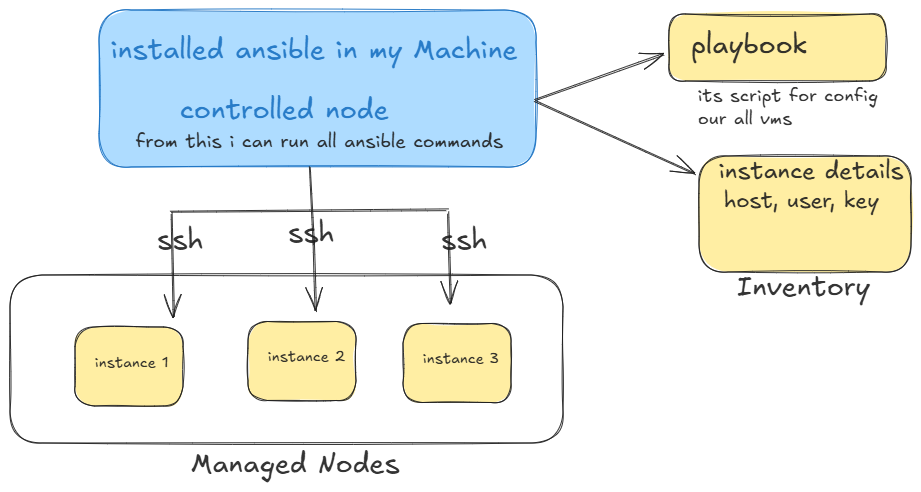

# setup one VM on aws with configuration

- create VM
- connect with VM using SSH and execute below steps
    - install softwares (Nginx, docker, Node JS)
    - OS settings (fire wall)
    - Users and Permissions
    - environment variables
    - application setup

# what if i want to manage 10 servers
- manual setup
- Human errors
- working with machines can be problem

# with CM (configuration Management)

- same setup everywhere
- automated (no human error)
- easy scale (change from 10-20 possible)

## Popular CM tools

- Ansible
- Chef
- Puppet

### What is Ansible??

- configuration management tool + automation tool
- using these:
    + configure servers
    + deploy application
    + automate task



- Ansible works in controlled and managed nodes

1. controlled node: Here we install ansible and we run ansible commands
2. Managed nodes: Like AWS instances where my script (playbook is execited)

### install Ansible 

- open wsl / terminal

```bash
sudo apt update && sudo apt install ansible
# brew install ansible (mac users)
ansible --version
```