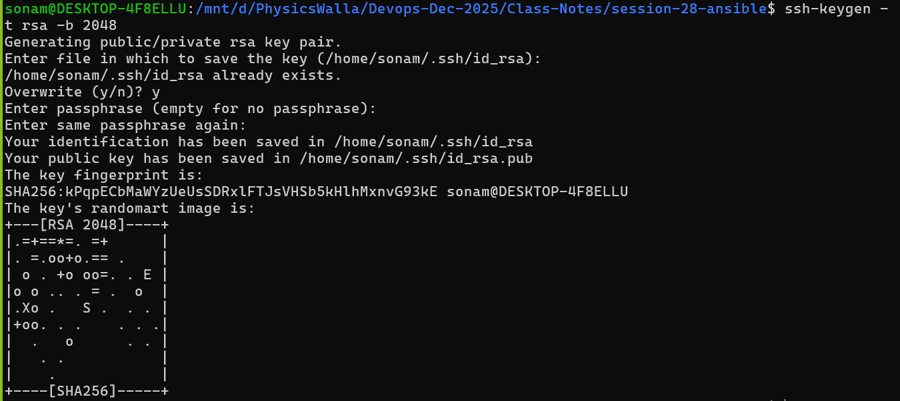

# generate SSH key for password-less login

- generate key using ssh-keygen

```bash
ssh-keygen -t rsa -b 2048
```


- go with no passphrase you can keep it empty
- this will help us to generate key

# password less auth option1:

```bash
ssh-copy-id ubuntu@ip_address_of_your_host
# once its done you can directly try to connect
ssh ubuntu@ip_address (it will connect with instance directly)
```
**In our case instance created using pem so default it will ask for .pem**
- we can configure our key which is generated inside our istance
- cat ~/.ssh/id_rsa.pub (copy public key)
- we need to connect with instance using ssh with pem
- follow below commands

```bash
mkdir -p ~/.ssh
chmod 700 ~/.ssh
nano ~/.ssh/authorized_keys
chmod 600 ~/.ssh/authorized_keys
exit
```
- now try to directly connect you can connect without pem file
- this is called password less authentication.