# Dynamic Inventory

- Dynamic Inventory automatically fetches host details from cloud providers or APIs using static inventoy.
- the aws_ec2 dynamic inventory plugin makes API calls to aws account and get the list of hosts (vm / instance) dynamically.
- using that we manage infra

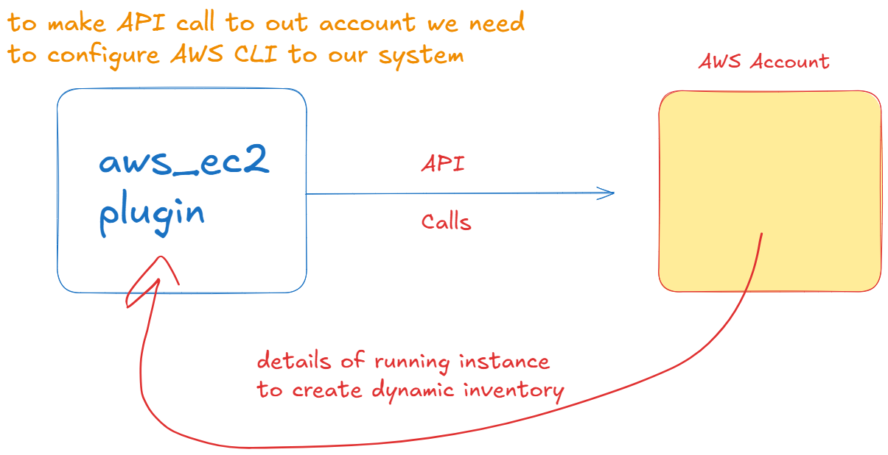

```bash
curl "https://awscli.amazonaws.com/awscli-exe-linux-x86_64.zip" -o "awscliv2.zip"
sudo apt install unzip
unzip awscliv2.zip
sudo ./aws/install
aws --version
```

- now go to AWS console account
- search for IAM service
- click on IAM
- click on IAM users
- create new user

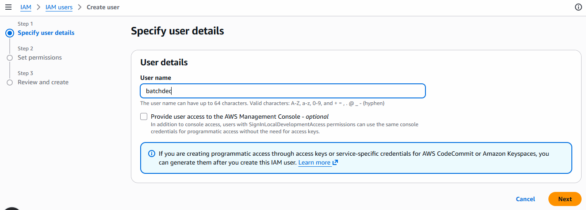

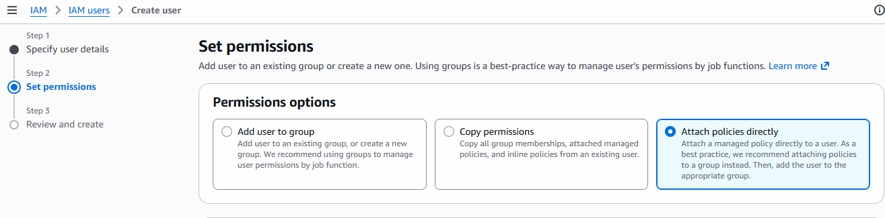

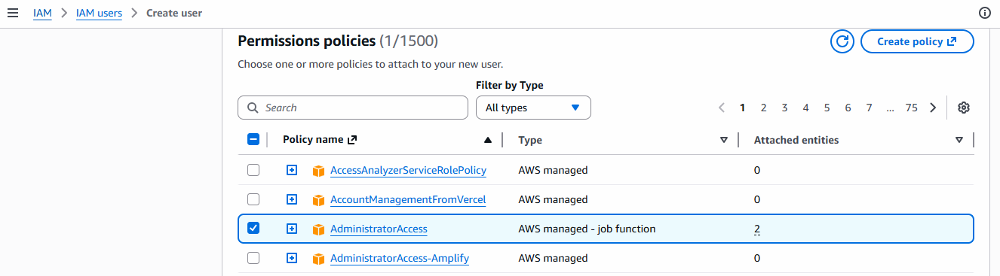

- click on next
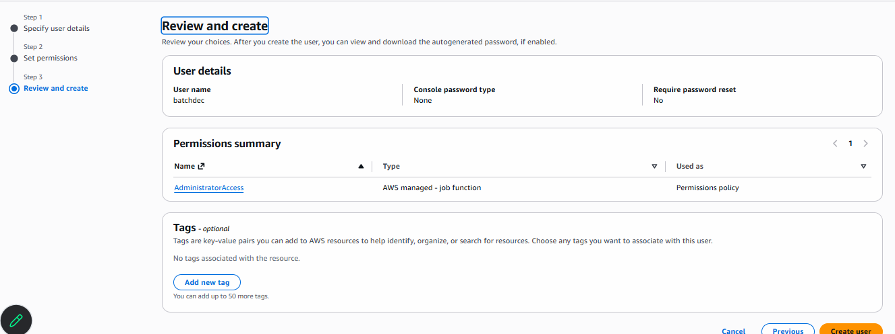

- review anc click on create User

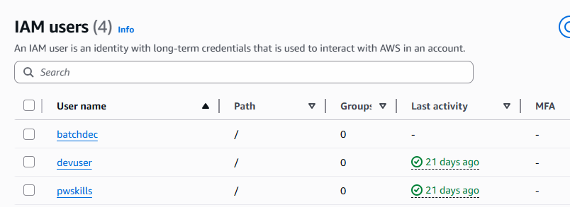

- click on newly created user and you can see below screen

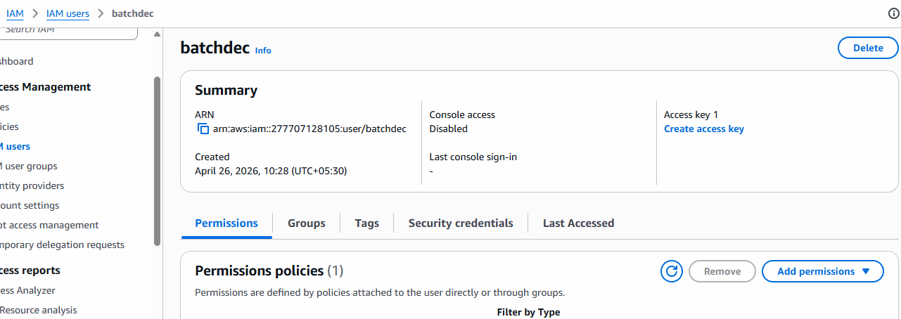

- click on create access key

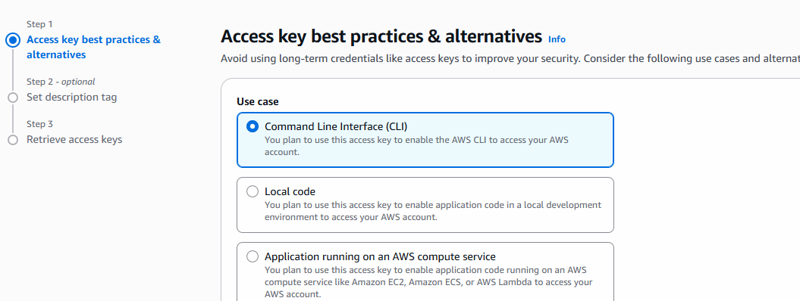

- click on confirmation checkbox and click on next
- give description and create key

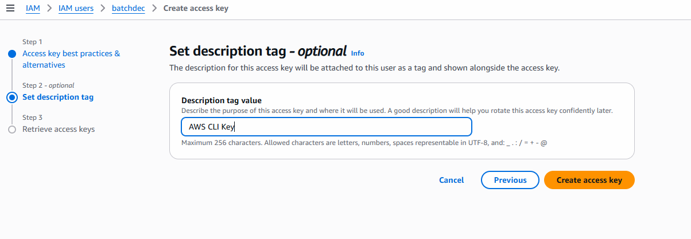

- you can see belo kind of key

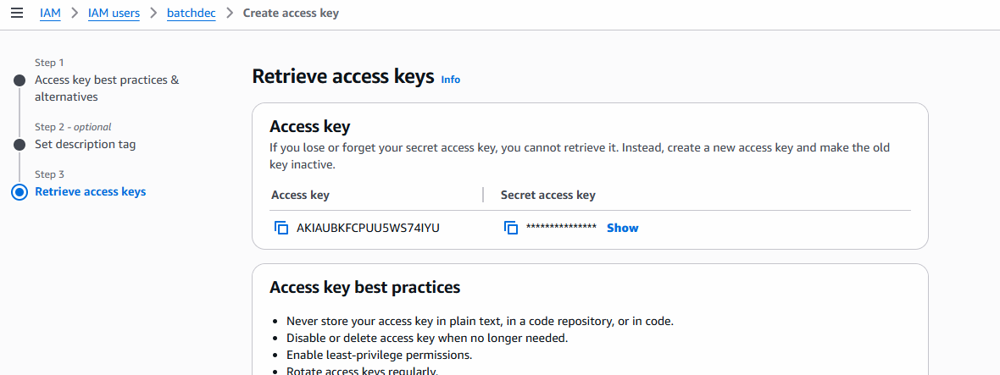

- make sure you download this key details csv file beacause you can't see this again.
- there is download .csv file button was there.
- click on done

- Now i will use them to configure AWS CLI
- in terminal run below commands

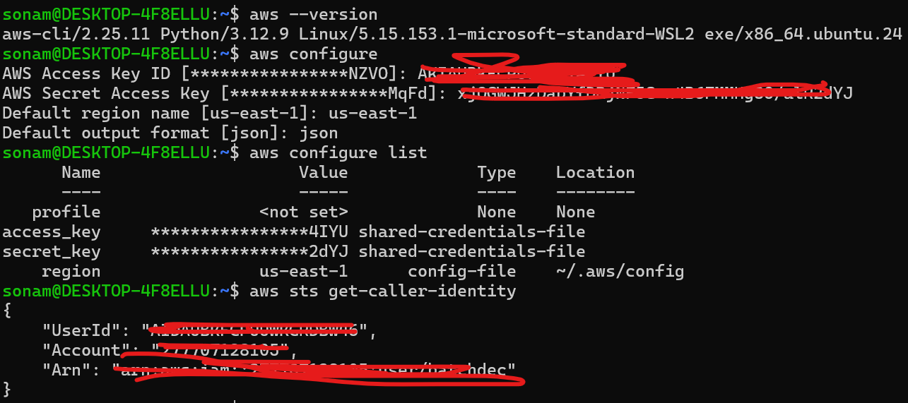

```bash
aws configure
aws configure list
aws sts get-caller-identity # you can see your aws account info
```