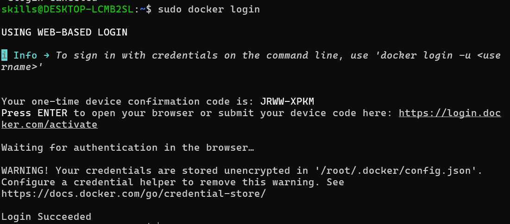
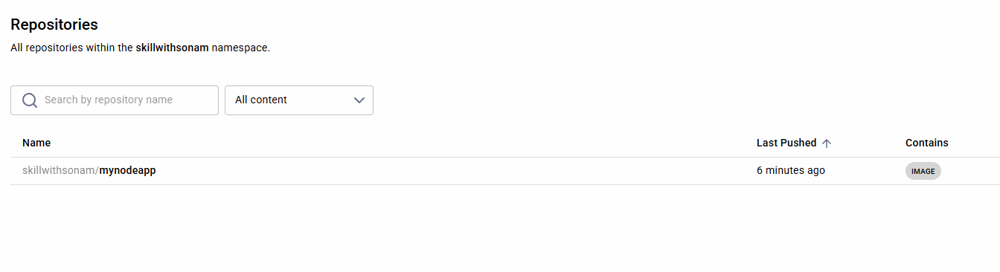
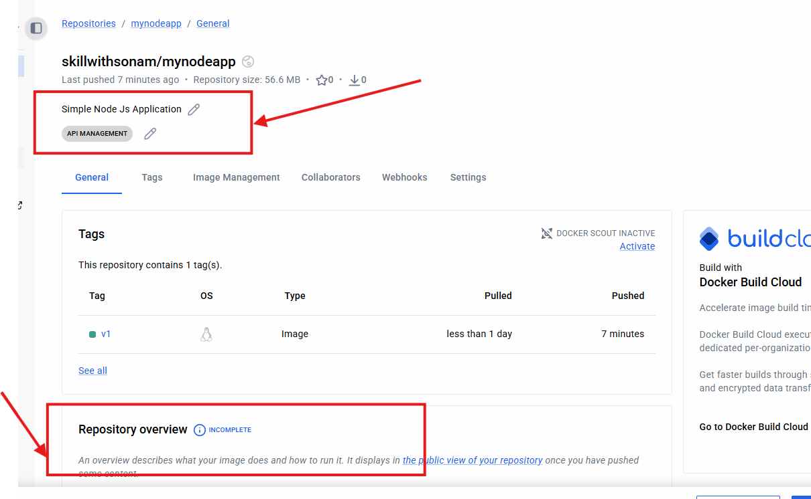
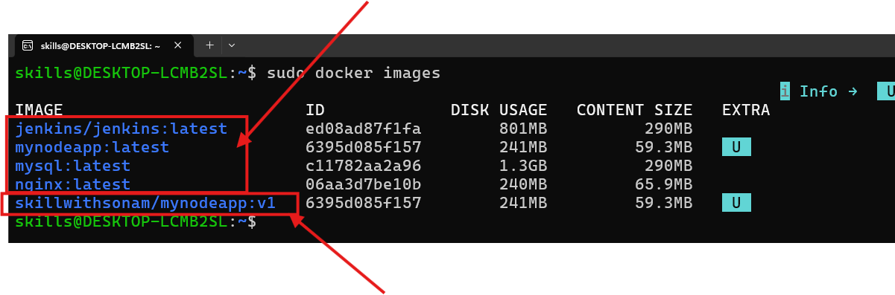

# Creating Images

- for any project, if you wnat to create Docker image

- How ??
- create Dockerfile
- file name is Dockerfile without any extention
- in this file we need to set some configurations like os, base image, dependencies, how to run application, which port required to expose.

## Basic Components of Dockerfile

1. FROM: starting point (Base Image)
2. WORKDIR: set working directory inside container
3. COPY: copy your codes from host system to container
4. RUN: Execute command for dependency install
5. CMD: Default command to start comntainer
6. ENV: set environment variables
7. ENTRYPOINT: Main Command that always run, use to start an app
8. EXPOSE: inform container to listen which port

## Let's Create Docker file for node project

```bash
sudo docker build -t mynodeapp .
# docker build to build an image
# -t target name of image mynodeapp
# . indicating location of dockerfile which is root location
sudo docker images 
# you can see new created image
# let's run image
sudo docker run -d --name nodeapp -p 3000:3000 mynodeapp
sudo docker ps
# if container is up check localhost:3000 in browser
sudo docker logs nodeapp
```

*If you are chnaging code of your project then build image again, stop old running container and start new container*

## Push Image to Docker Hub

1. Create Account on DockerHub
2. once account is created open wsl

- let's Login from WSL



- open the coming in browser, enter device code, login with your credentials and you can see login success in terminal

3. Let's Push image to docker hub

- Tag image and then push

```bash
sudo docker tag mynodeapp:latest skillwithsonam/mynodeapp:v1
# here skillwithsonam is my docker hub username
# mynodeapp i want to give as repo name
# v1 is the tag showing version1
sudo docker push skillwithsonam/mynodeapp:v1
# go to browser and refresh dockerhub page
# check repositories
```



- you can add description categories
- also add overview of your repository like md file



- now if you see docker images you can see both local + docker hub

