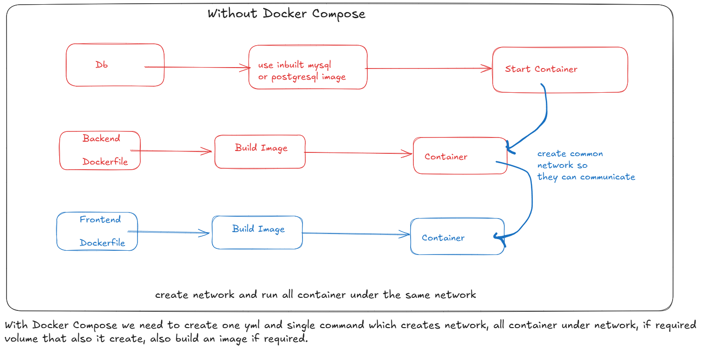

# Docker Compose



- Docker Compose will help to run multiple container services
- it helps to manage shared netwwork, volume in structured way.

## Let's Implement

- create Folder Called docker-compose-project
- move to that folder and create folder named Backend
- run commands

```bash
cd docker-compose-project/backend/
npm init -y # create package.json file
npm i express mysql2 # install packages
# delete node_modules folder which is generate when you executed npm i command
# we will manage dependencies using docker image
```

- create server.js file (add below mentioned code)

```js
const express = require("express");
const mysql = require("mysql2");
const app = express();

const db= mysql.createConnection({
    host: process.env.DB_HOST,
    user: process.env.DB_USER,
    password: process.env.DB_PASSWORD,
    database: process.env.DB_NAME,
})
db.connect(err =>{
    if(err) throw err;
    console.log("MYSQL Connected")
})
app.get("/", (req, res) => {
  res.send("Backend is Running!");
});

app.listen(3000, () => {
  console.log("Server running on http://localhost:3000");
});
```

- to build image, create Dockerfile

```dockerfile
FROM node:22-alpine

WORKDIR /app

COPY package*.json ./

RUN npm install

COPY . .

EXPOSE 3000

CMD [ "node","server.js" ]
```

## Let's create Frontend

```bash
cd docker-compose-project
npm create vite@latest
# say yes with version mentioned
# project name: frontend
# variant: React
# language: Javascript
# say no to package install
# and your project is ready
```

- create docker-compose.yml file at root location
- add code for creating all 3 service run below commands

```bash
docker compose version
sudo docker compose up -d --build
# you can see image build, network, volume creation, conatiners started
sudo docker logs mysql_container
sudo docker logs backend
sudo docker logs frontend
# also access in browser
# http://localhost:3000/ (backend URL)
# http://localhost:5173/ (Fronten URL)

sudo docker compose down
# it will stop and remove all containers
# also remove network
```