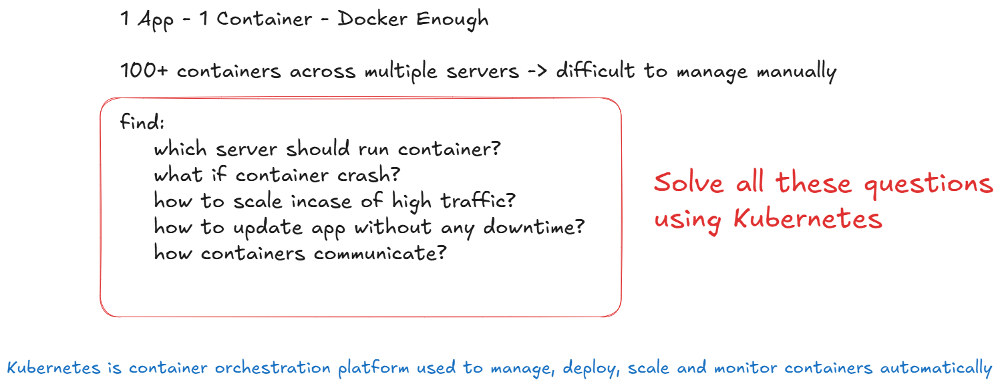
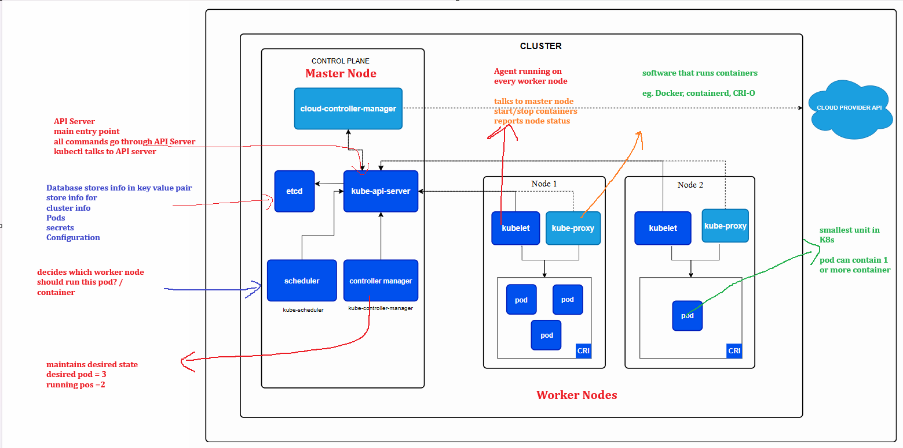
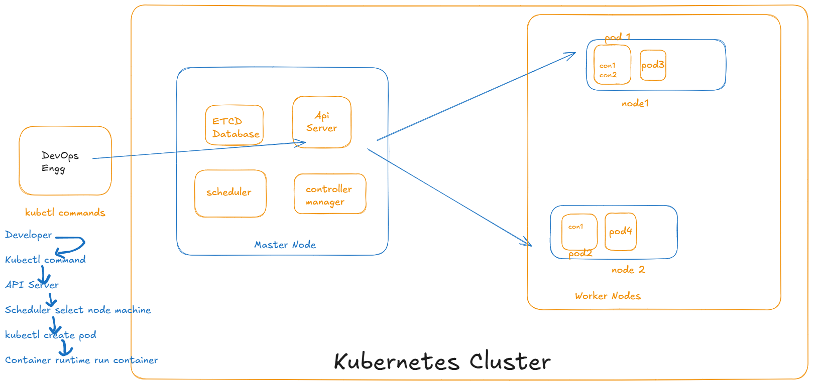

# Kuberenetes



## Kubernetes Features

- Auto healing (restart failed containers)
- Auto Scaling
- Load Balancing
- Rolling Updates (version updates)
- Seelf Management
- High Availability

## Kubernetes Architecture





- We need to install Kubectl to run Kuberenets Command
- We need to Setup MiniKube Cluster to work with Local Kubernetes Cluster

```bash
# Download Latest Release
curl -LO "https://dl.k8s.io/release/$(curl -L -s https://dl.k8s.io/release/stable.txt)/bin/linux/amd64/kubectl"
#  Download Kubectl Checksum File
curl -LO "https://dl.k8s.io/release/$(curl -L -s https://dl.k8s.io/release/stable.txt)/bin/linux/amd64/kubectl.sha256"
# validate you can see OK in Result
echo "$(cat kubectl.sha256)  kubectl" | sha256sum --check
# Install Kubectl
sudo install -o root -g root -m 0755 kubectl /usr/local/bin/kubectl
# Check Version
kubectl version --client
```