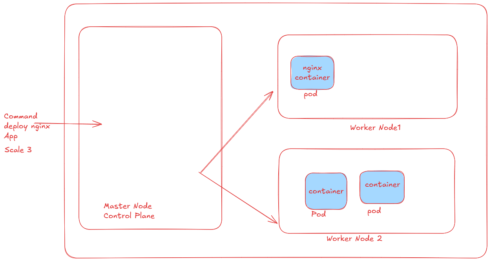
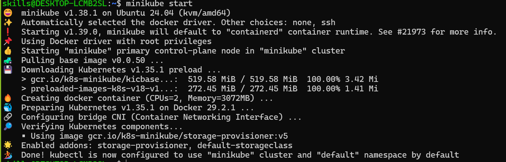
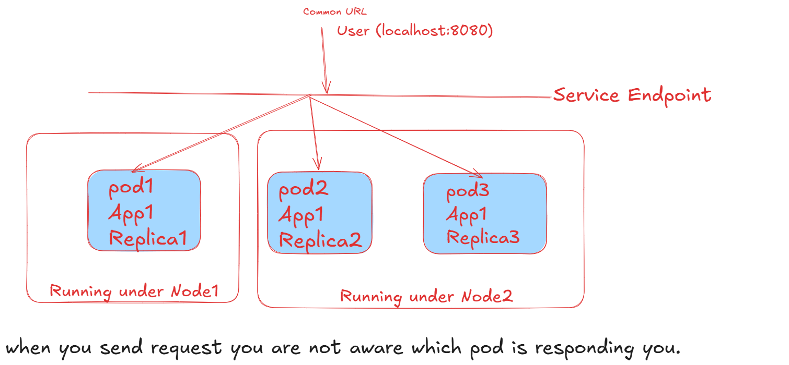
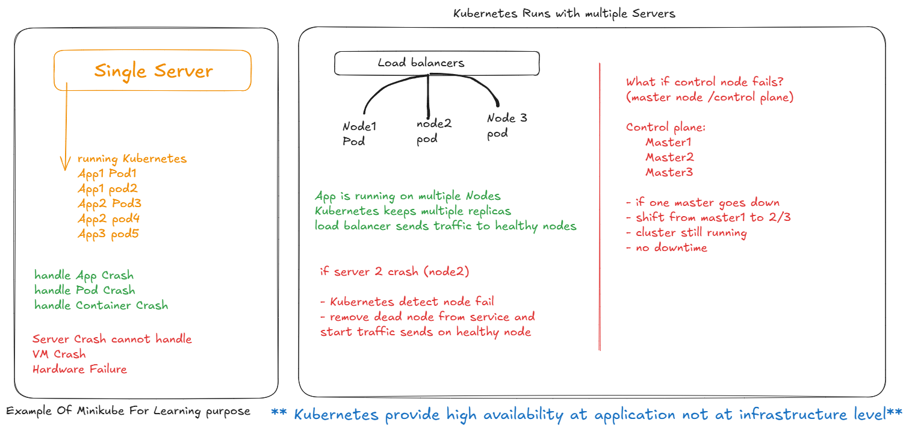

# Kubernetes Cluster



- Let's Create Local cluster using minikube

```bash
# Installation
curl -LO https://github.com/kubernetes/minikube/releases/latest/download/minikube-linux-amd64
sudo install minikube-linux-amd64 /usr/local/bin/minikube && rm minikube-linux-amd64

# Permission Related Error
sudo usermod -aG docker $USER
newgrp docker
# 
# Start Your Cluster
minikube start

# if its configured
kubectl cluster-info

kubectl get nodes
#  you can see single machine as control-plane which is master node
```


- to communicate with docker we need access to this place unix:///var/run/docker.sock
- this requires root access so we used to run command with sudo
- now we are adding current user in docker group 
- so now current user will have permission to access this locationb directly
- sudo usermod -aG docker $USER (adding user to docker group)
- newgrp docker (starts a shell session with docker group which active immediately so no need to restart the terminal)


# Create Pod

```bash
kubectl run my-pod --image=nginx --port=80
kubectl get pods # you can see container creating 0/1
kubectl describe pod my-pod
kubectl get pods # you can see container running 1/1
```

## Service

- Expose an application running in cluster behind a single outward facing endpoint even when the workload is split across multiple backends.



```bash
kubectl expose pod my-pod --type=NodePort --port=80
kubectl get svc
# you can see the service exposed
# its exposed in ClusterIP:Port but that we can't access as cluster is running on localhost
# to access use below command
minikube service my-pod
#  see the url is tunneled with localhost url use that to access output
#  incase if you are geting error related to browser and not able to access service
# use below flag --url
minikube service my-pod --url
# copy URL paste in browser and access 
# Clean Resources
kubectl delete service my-pod
kubectl delete pod my-pod
```

## Create Pod using yml file

- create pod file (my-pod.yml)

```bash
kubectl apply -f my-pod.yml
kubectl get pods
kubectl describe pod nginx
```

- Create Service 

```bash
kubectl apply -f my-service.yml
kubectl get svc
kubectl describe svc my-service
minikube service my-service --url

kubectl delete service my-service
kubectl delete pod nginx
```

