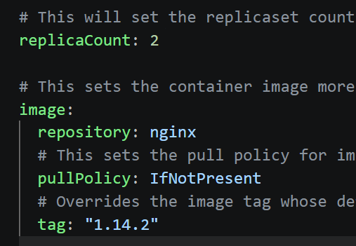

# Helm Chart

- Helm as package manager for kubernetes
- Helm chart is a collection of Kubernetes YML files packaged together so we can deploy application easily.

- without helm you need to create files manually
    - like
    - deployment.yml
    - service.yml
    - configmap.yml
    - ingress.yml

- with helm just run one command and all files will get generated.

```bash
sudo snap install helm --classic
helm version
helm create myapp
# you can see folder myapp created
# edit values.yml
```


```bash
helm install myapp ./myapp/ --debug
# it will create deployment, pods, services etc
kubectl get deployment
kubectl get pods
kubectl get service

helm list
#  for upgrade go to values and update replica count to 5
helm upgrade myapp ./myapp/
kubectl get deployment # 5/5 pods running
helm history myapp
helm rollback myapp 1 # 2/2 pods running
kubectl get deployment
helm uninstall myapp
# remove all deployments, service, secrets everything created by helm
```