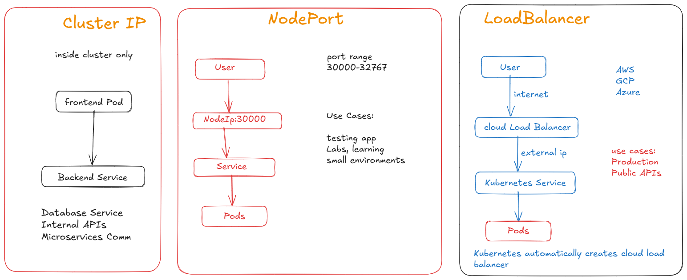
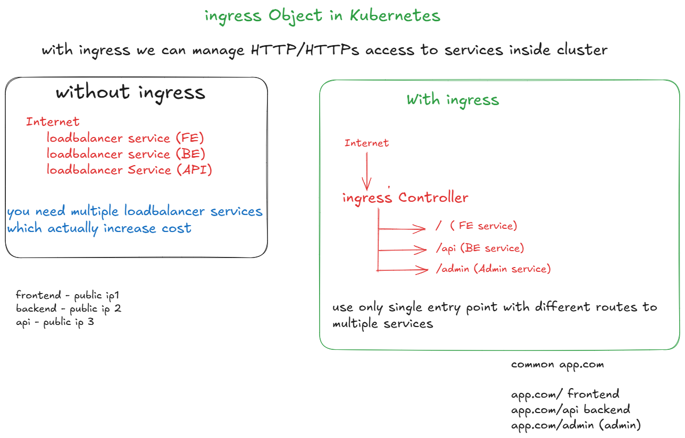

# Service

# CoreDns

- kubectl get pods -n kube-system
- you can see one pod is running named core-dns 
- if you trying to access http://backend
- it will find out relavant Ip address to that service
- you can see the response coming from that pod

