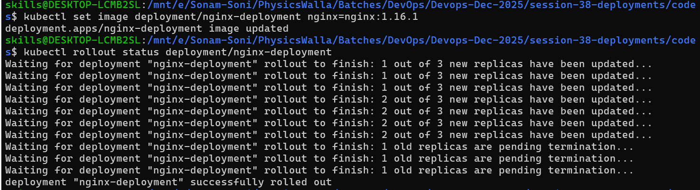

# Deployments

[Ref Doc link](https://kubernetes.io/docs/concepts/workloads/controllers/deployment/)
- Deployment is higher level controller which manages
    + Replicasets
    + Pods
    + updates (rollouts)
    + Rollbacks
    + Scaling

*Deployment is manages ReplicaSet, Replicaset is managing Pods*

**How to create?**

- create file named deployment.yml

```bash
kubectl apply -f deployment.yml
kubectl get deployment
kubectl get pods
kubectl describe deployment nginx-deployment
# update Deployment
kubectl set image deployment/nginx-deployment nginx=nginx:1.16.1
# verify rollout
kubectl rollout status deployment/nginx-deployment
# verify replicasets
kubectl get rs
# you can see old deleted and new created one
kubectl describe deployment nginx-deployment
# Check History
kubectl rollout history deployment/nginx-deployment
# check for each version details
kubectl rollout history deployment/nginx-deployment --revision=2
kubectl rollout history deployment/nginx-deployment --revision=1

# Rollback
kubectl rollout undo deployment/nginx-deployment
#  above command will change version from 1.16.1 to 1.14.2
# check all above commands again to see status, history, version details
# also run describe command
kubectl delete deployment nginx-deployment
```


# to get Change Cause in history use annotations

- update file deplopyment.yml with annotation 
- use 1.14.2 version and mention once cause
- execute apply command
- again change version mention change cause and again run with apply command.
- check history

```bash
kubectl apply -f deployment.yml
kubectl get deployment
kubectl get pods
kubectl describe deployment nginx-deployment
# update Deployment by change file
kubectl apply -f deployment.yml
# verify rollout
kubectl rollout status deployment/nginx-deployment
# verify replicasets
kubectl get rs
# you can see old deleted and new created one
kubectl describe deployment nginx-deployment
# Check History
kubectl rollout history deployment/nginx-deployment
```