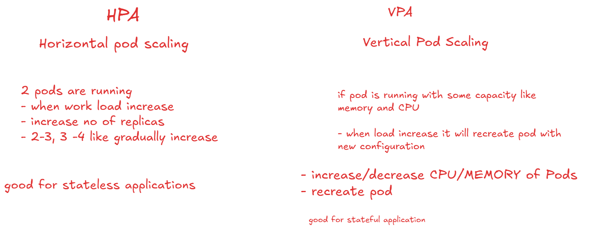

# Least Privilege Access in containers 

- Attack Surface is the total number of ways attacker can damage system. When containers have more permission can damage system more.

- by giving limited previleges can secure
    - containers cannot access sensitive files
    - app cannot have unauthorized access.

- Running a Pod as root user is Bad Practice

- security context configurations in pod and container:
[Documentation](https://kubernetes.io/docs/tasks/configure-pod-container/security-context/)

## Image Scanning Tool

- to scan images we have 2 tools

1. clair:
    - static analysis of container images
    - Detect known CVEs
    - suitable for enterprise environments
2. trivy
    - detect CVEs
    - misconfigurations
    - secret issues
    - licences issues

### How to work with trivy

```bash
# Installation Steps
sudo apt-get install wget gnupg
wget -qO - https://aquasecurity.github.io/trivy-repo/deb/public.key | gpg --dearmor | sudo tee /usr/share/keyrings/trivy.gpg > /dev/null
echo "deb [signed-by=/usr/share/keyrings/trivy.gpg] https://aquasecurity.github.io/trivy-repo/deb generic main" | sudo tee -a /etc/apt/sources.list.d/trivy.list
sudo apt-get update
sudo apt-get install trivy

trivy -v

trivy image nginx:latest # scann image
trivy image your_image_name # scann image
```

## RBAC

- create role.yml, service-account.yml and role-binding.yml

```bash
minikube start
kubectl apply -f role.yml
kubectl get role
kubectl apply -f service-account.yml
kubectl get sa
kubectl apply -f role-binding.yml
kubectl get rolebinding
kubectl describe rolebinding dev-user-binding

# lets verify
kubectl auth can-i list pods --as=system:serviceaccount:default:dev-user #yes
kubectl auth can-i watch pods --as=system:serviceaccount:default:dev-user
kubectl auth can-i watch secrets --as=system:serviceaccount:default:dev-user
kubectl auth can-i list secrets --as=system:serviceaccount:default:dev-user
kubectl auth can-i list deployment --as=system:serviceaccount:default:dev-user # no
kubectl auth can-i create pod --as=system:serviceaccount:default:dev-user # no

kubectl delete rolebinding dev-user-binding
kubectl delete role dev-user
kubectl delete sa dev-user
```

## Practice Task

- Similar to this you can try to create
    + cluster Role
    + Cluster Role Bining

[Documentation To Follow](https://kubernetes.io/docs/reference/access-authn-authz/rbac/)

## Security can managed 
- by adding security context
- By using RBAC
- By adding Network Policies
[Network Policies](https://kubernetes.io/docs/concepts/services-networking/network-policies/)


## Scaling

