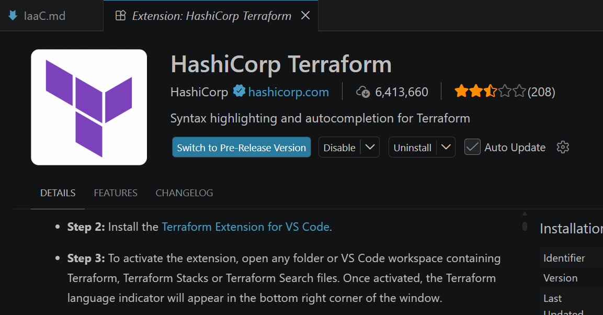

# IaaC - Infrastructure as a Code

- its a morden approach for provisioning infra (VM, databases, storages, networks) create using automated scripts rather than manual process.

- when we do traditional setup it must be:
    - time consuming
    - error prune (human errors)
    - difficult to replicate

- using IaaC, we can make developers life easy.

## IaaC follows 2 approaches

1. Declarative (What):
    - define what you want (desired state)
    - the tool which you are using will figure out how to achieve it.
    - Terraform
2. Imperative (How):
    - define how the infra should be created
    - write shel scripts
    - AWS CLI

## Popular Tools for IaaC

1. Terraform: declarative, state based, multi cloud
2. Chef/Puppet: CM tools using that we can create IaaC
3. Ansible: CM + IaaC

## terraform & Ansible

- Ansible is more focused on setup software inside servers: like installing packages.
- Terraform is more focused on creating Infra and servers, Terraform creates servers, storages, VPC (infra)


# Terraform

- Its IaaC tool
- following declarative approach using HCL
- install below extension in VS Code


- install Terraform [Reference Link](https://developer.hashicorp.com/terraform/tutorials/aws-get-started/install-cli)

```bash
# HashiCorp's GPG signature and install HashiCorp's Debian package repository.
sudo apt-get update && sudo apt-get install -y gnupg software-properties-common

# Install HashiCorp's GPG key.
wget -O- https://apt.releases.hashicorp.com/gpg | \
gpg --dearmor | \
sudo tee /usr/share/keyrings/hashicorp-archive-keyring.gpg > /dev/null

# Verify the GPG key's fingerprint.
gpg --no-default-keyring \
--keyring /usr/share/keyrings/hashicorp-archive-keyring.gpg \
--fingerprint

# Add the official HashiCorp repository to your system.
echo "deb [arch=$(dpkg --print-architecture) signed-by=/usr/share/keyrings/hashicorp-archive-keyring.gpg] https://apt.releases.hashicorp.com $(grep -oP '(?<=UBUNTU_CODENAME=).*' /etc/os-release || lsb_release -cs) main" | sudo tee /etc/apt/sources.list.d/hashicorp.list

# Update apt to download the package information from the HashiCorp repository.
# nstall Terraform from the new repository.
sudo apt update && sudo apt-get install terraform

terraform --version
```

# How to create files in Terraform

- terraform files have extension .tf
- written in HCL (hashicoro Language)

## Core Components

1. Providers: 
    - allows terraform to interact with cloud providers like aws, azure, gcp

```tf
provider "aws" {
    region = "us-east-1"
}
```

2. Resources: 
    - infra component like ec2,s3, vpc etc..

```tf
resource "aws_instance" "server" {
  ami           = "ami-0521cb2d60cfbb1a6"
  instance_type = "t3.micro"
  tags = {
    Name = "linux-vm
  }
}
```
3. Variables:
    - seperate variables in variables.tf
    - its automatically connected with main.tf file we can just use them.

*variables.tf*

```tf
variable "amiid" {
  default = "ami-0521cb2d60cfbb1a6"
}
variable "instance_type" {
  default = "t3.micro"
}
variable "key_name" {
  default = "pwskills"
}
variable "instance_name" {
  default = "linux-vm"
}
```

*main.tf*

```tf
resource "aws_instance" "server" {
  ami           = var.amiid
  instance_type = var.instance_type
  key_name = var.key_name
  tags = {
    Name = var.instance_name
  }
}
```

4. Outputs
- when resource created we want to get that resource id, public ip, DNS name, endpoint etc.
- for that we can create outputs.tf file

*outputs.tf*

```tf
output "public_ip" {
  value = aws_instance.server.public_ip
}
output "public_dns" {
  value = aws_instance.server.public_dns
}
output "instance_id" {
  value = aws_instance.server.id
}
```

- now how to run them

```bash
terraform init # initialize TF project
#  this needs to be executed only once
terraform plan # to see plan which resources will be created
terraform apply # ask manual approval before creating resources you can type yes
# terraform apply --auto-approve # to skip manual approval
#  if code changes again do terraform apply

#  to destroy resources
terraform destroy --auto-approve
```