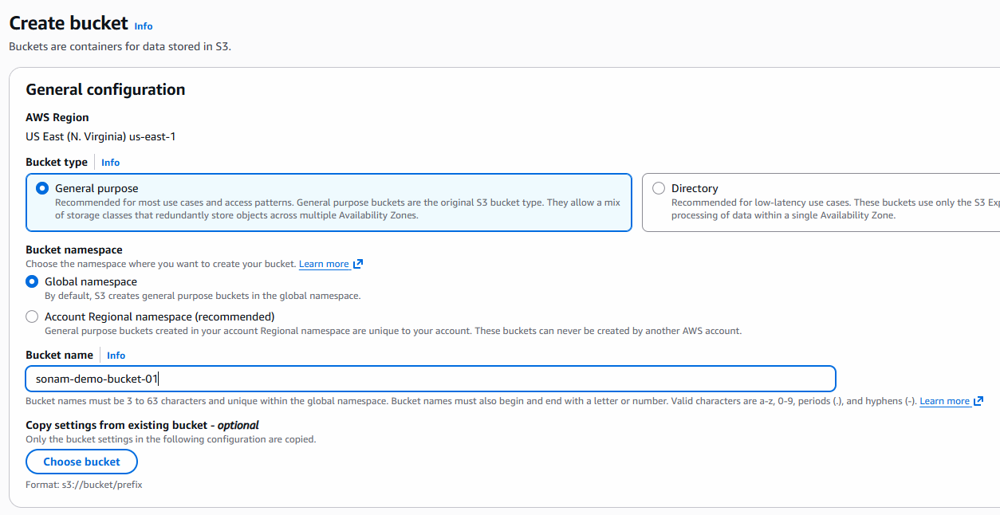
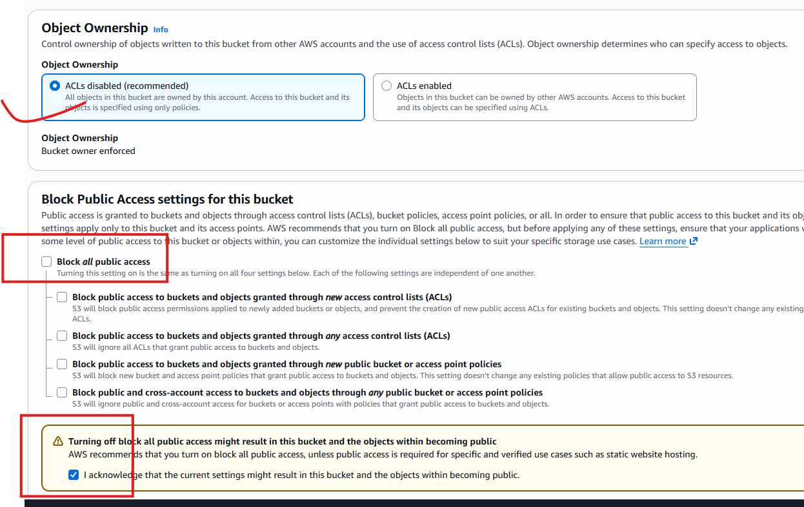
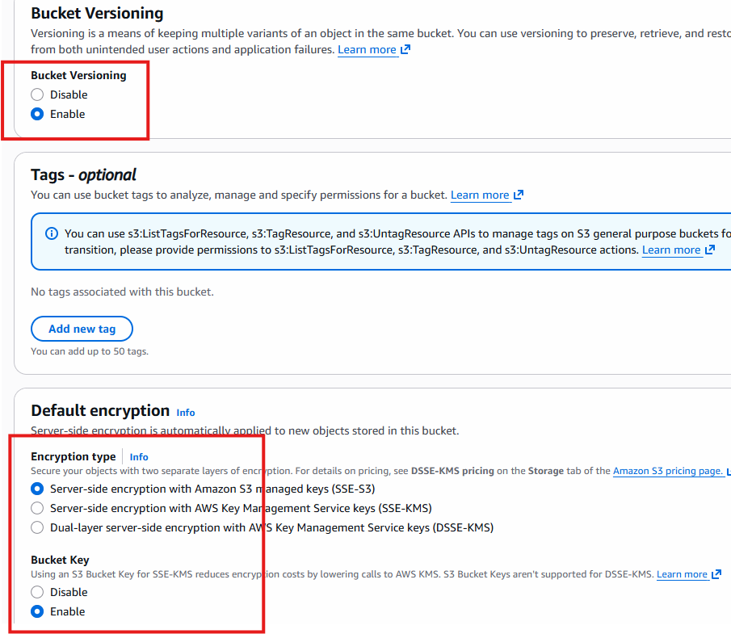
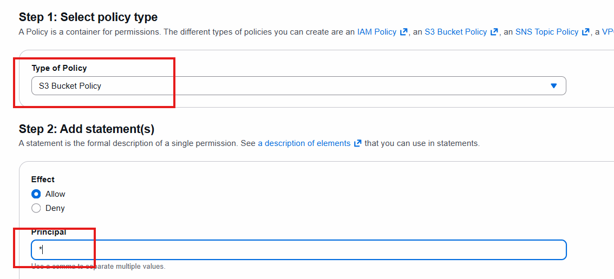
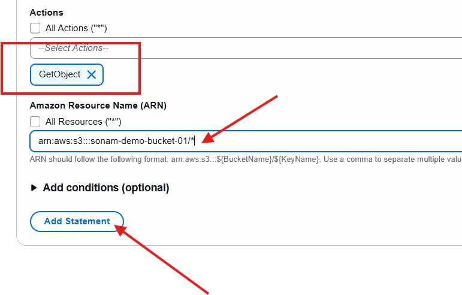
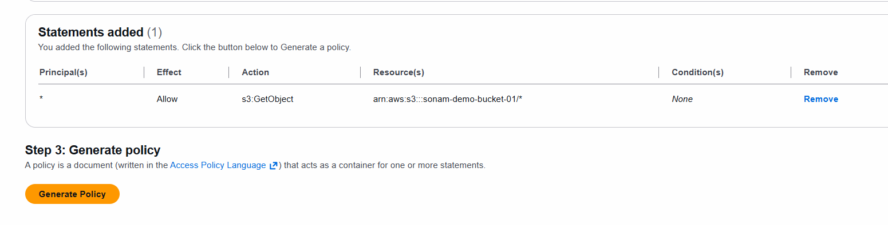
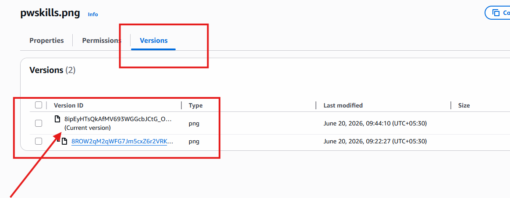

# Introduction to S3 Bucket

- S3 - S(Simple) S-(Storage) S-Service
- Here we can store any type of data and access it from anywhere.

1. Create S3 Bucket
- Aws Console - search for S3 - click on it - you can see create Bucket button
- 

- 

- 

- click on create Bucket.

- Once Bucket is Created select upload and try to upload some image or file
- when you upload you can see its creating an Object which is having its own meta data, etag, key name etc.
- when you try to access this object using Object URL, its not accessible

**How to set Permission?**

- using Bucket Policy
- how to create Bucket Policy?

[AWS Policy Generator](https://awspolicygen.s3.amazonaws.com/policygen.html)

- when you click on add statement statement will be added like this

- similar like this you can add more statements

*Here Principle: who is performing the actions(user)*
*Here Action: what they can do like get object, put object*
*Here Resource: On what resource, bucket-arn/* like this*

- click on create Policy So you can see JSON code generated.
- now copy the policy and go to bucket
- permission -> Policy -> edit - paste that JSON code -> save Changes

- try to access that Object again you can see that image.

*we have already enabled versioning of Bucket*

- try to upload that same object again in the bucket.
- now open that onject and click on version tab you can see 2 versions of same object

