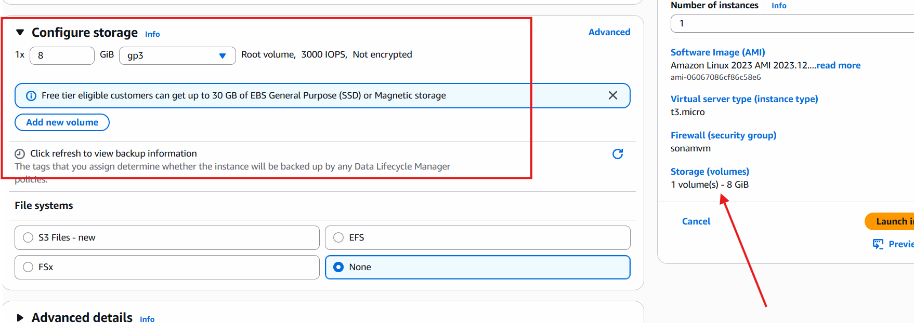
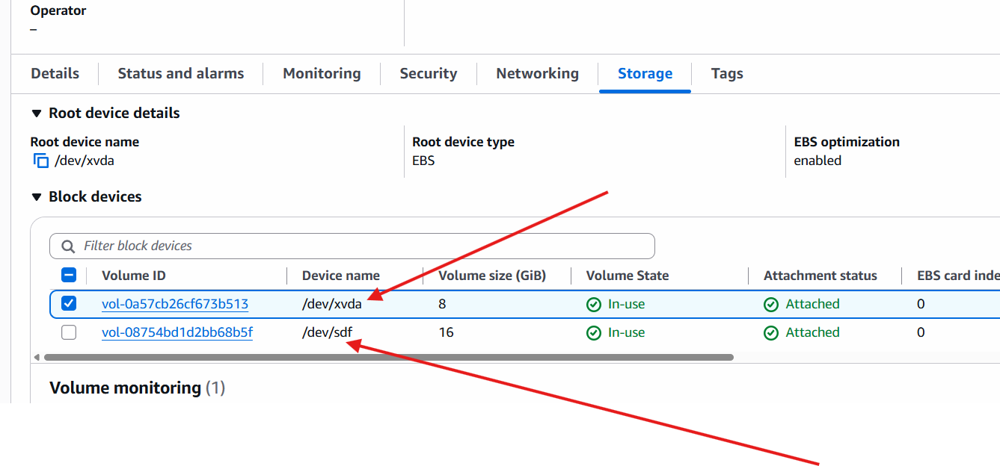
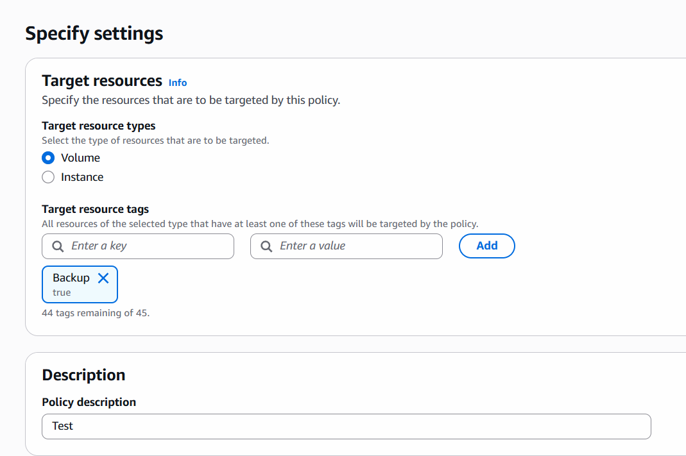
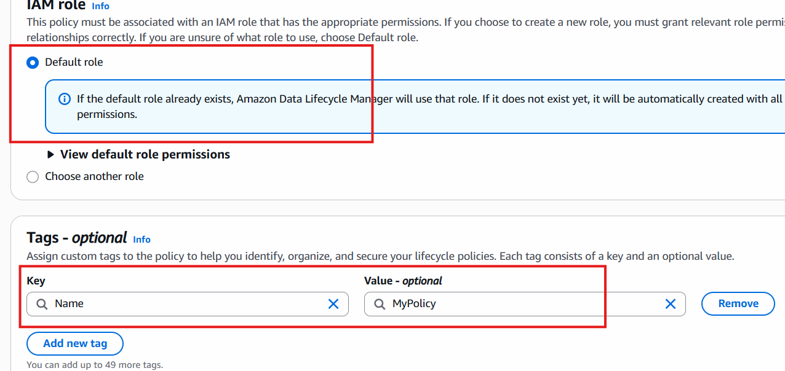
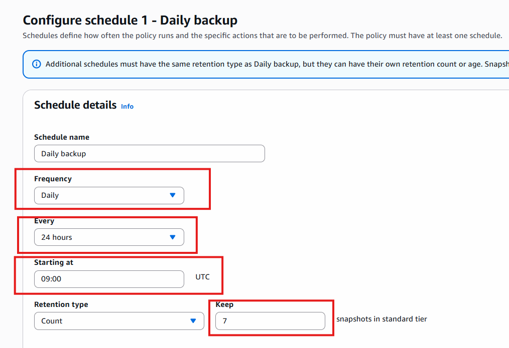

# Backups

- Disaster Recovery Backups are very important.
- many ways to do backups like EBS, S3 Backups, RDS backups

## EBS Snapshots

- EBS: Elastic Block Store - storage provided By EC2 
- By default when we create instance volume added to it but if you want to add extra volume to your instance that also we can manage using EBS.
- This volumes backup we can take using **SnapShots**

## Let's Create Instance to understand This.

- while creating instance we configure volume.

- if you check volumes you can see 1 volume which is connected with this instanceID.

## Add Extra Space to this instance

- create new Volume.
- before create volume check your instance running in which zone and based on it create volume to that zone.
- create volume, give size of 16 GB 
- General Purpose Volume, then chose zone
- give tags: Name: Extra volume

- create. 

## Attach volume to instance

- select volume
- actions, attach volume to instance
- select device name like sdf (f drive)
- attach.

- once attach done check instance and see storage

- Detach volume by refreshing the state

## Backup of volume

- create snapshot
- select volume
- add description
- tag: add name - Name: backup volume
- create (this is the backup of your volume)
- this manual backup process

## Automated Backup

- best and recommened way for backup
- AWS LM (LifeCycle Manager)

- It will  create automatic backups, Retails and delete old EBS snapshots

1. Go to AWS Console -> EC2 Dashboard -> EBS (Elastic block Store) -> LifeCycle manage 
2. select default policy -> next
3. give description , go for default role (It will create new role for taking backups of all volumes automatically)
4. if you have existing choose that otherwise go for new creation only.
5. Schedule Details -> creation (7 days) , retention (14 days)
6. Exclude is Optional but you can choose if you want to skip backup of some boot volumes and any perticular volume backup.
7. Advanced Settings you can se copy cross region for disaster recovery.
8. policy tags: Give Name of the Policy:
    Name: My Volume Backup

9. This sam key value tags you use while creating instance and volumes so your lifecycle manager will search these resources based on given tag and start taking backups.
10. then create Policy.

*Default policy takes backup of all* 

## Create Custom policy

*Any volume which is having tag named Backup and value is true which is automatically backeup using this policy*

- Policy Status: Enabled

## Backup using S3 Bucket

- create S3 bucket
- enable versioning for quick backup
- means if new file deleted we can get only from versioning

- bucket -> Management -> Lifecycle rules -> create rule to keep limited version of  files means keep only 3 latest versions and delete the older ones.

*Another way for backup is creating replication rule*

*practice Task to explore for Backups*

### Task: Explore Automated Backups in RDS (Relational DB Service)