# Implement Cloudwatch Monitoring

1. Login to AWS Console
2. Create Linux VM using Linux Image
3. Once Instance is running Let's Setup an Alarm
4. Go to CloudWatch Console

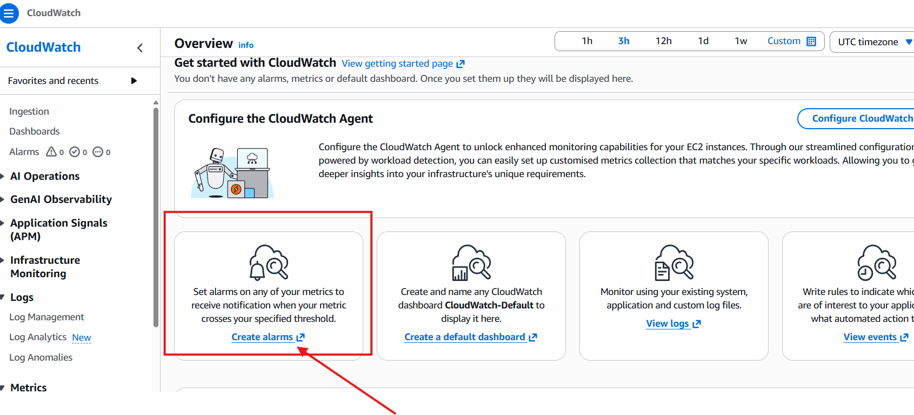

5. Click on Create Alarm -> you will be redirect to create alarm screen
6. Select Metric, type, Classic

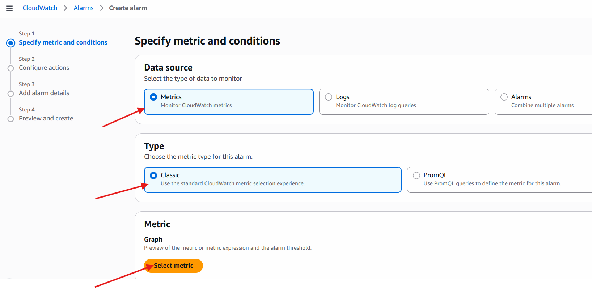

7. click on select Metric

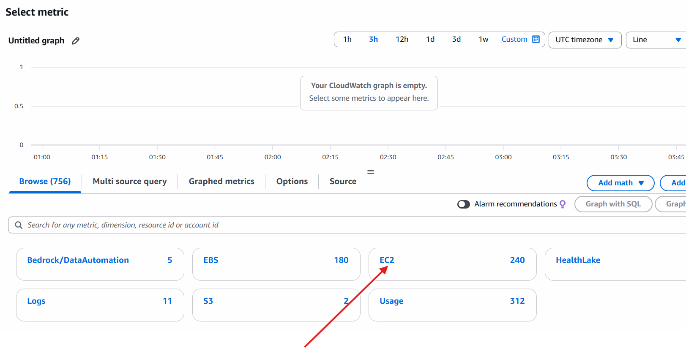

8. Select EC2

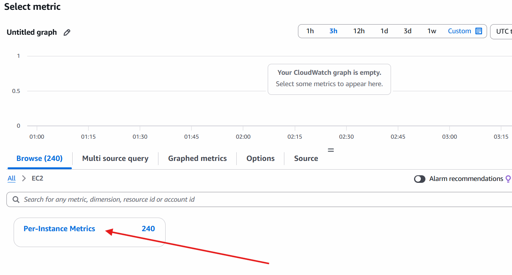

9. Select Per instance Metrics

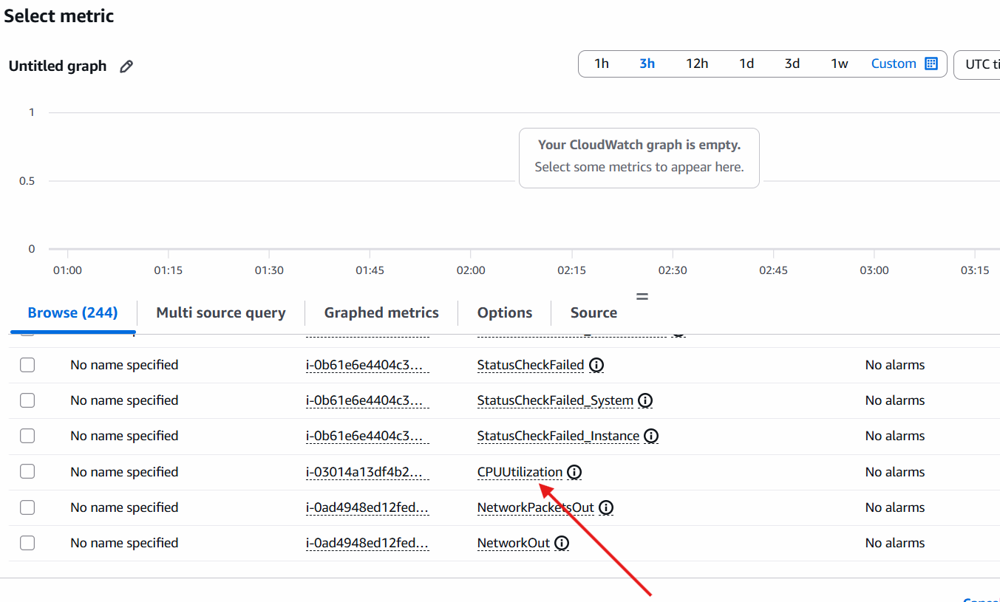

10. Select CPU Utilization

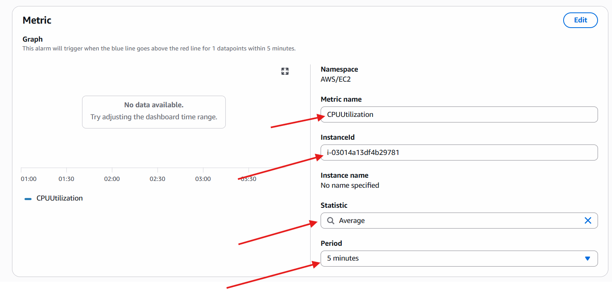

11. Configure the values (make sure Instance ID is the same that you want to monitor)

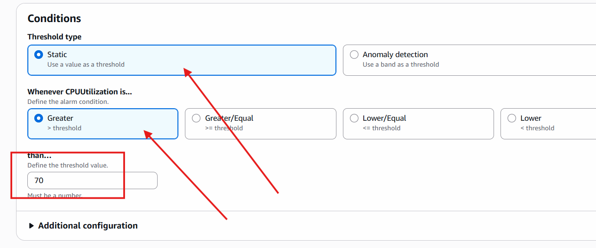

12. Click on next, here we need to configure Notification. These Notification we are configuring for the very first time to create new Topic, if you have already available you can use old one.

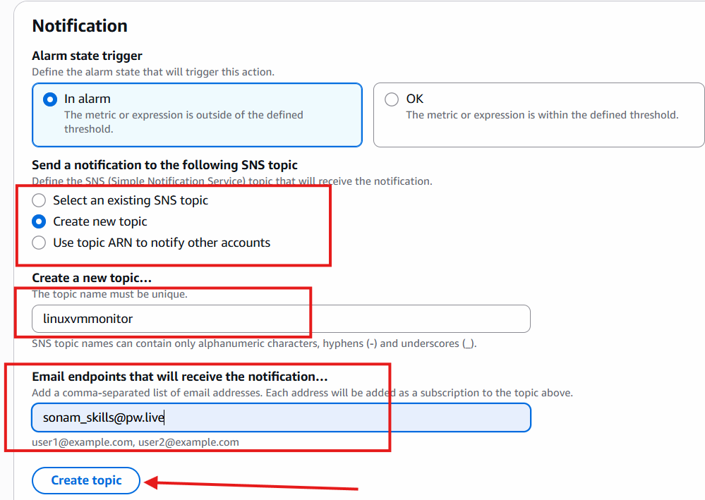

13. click on Create Topic
14. keep all below options as it is and click on next.
15. verify your configurations and then click on next.

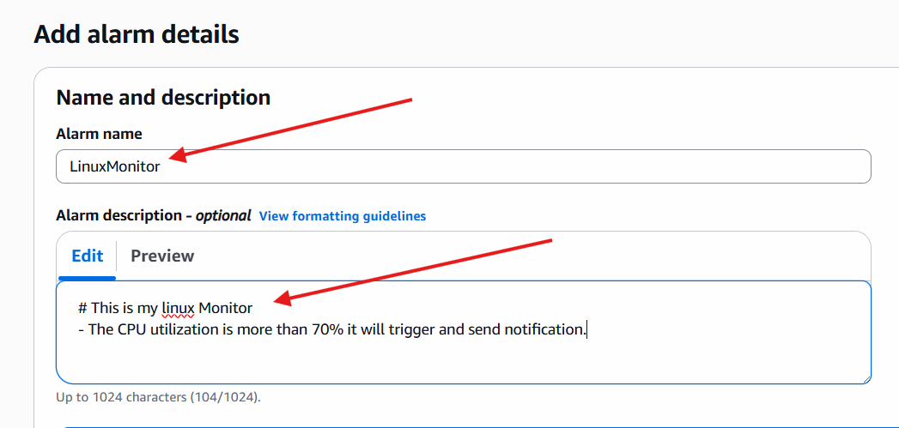

16. create Alarm (Alarm created but its showing some warning)

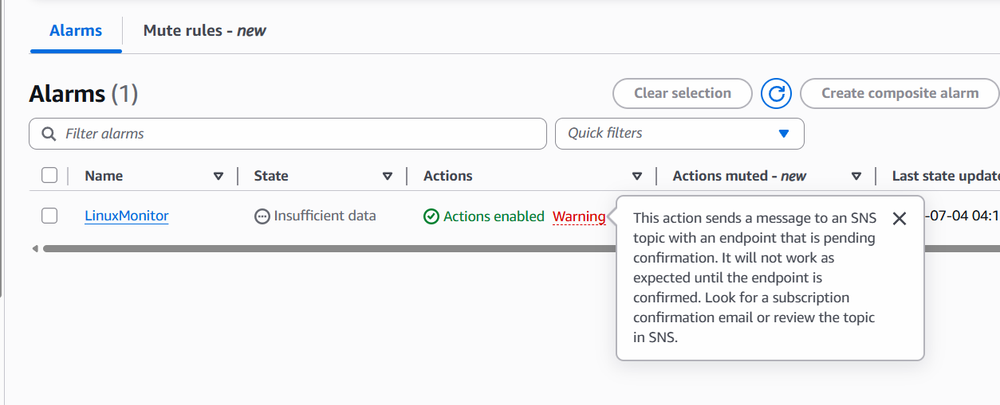

17. Confirm Email Subscription by going to your email which is given while creating topic.

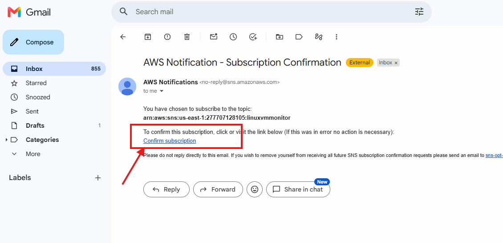

- now you can check alarm and refresh and there is no warning.

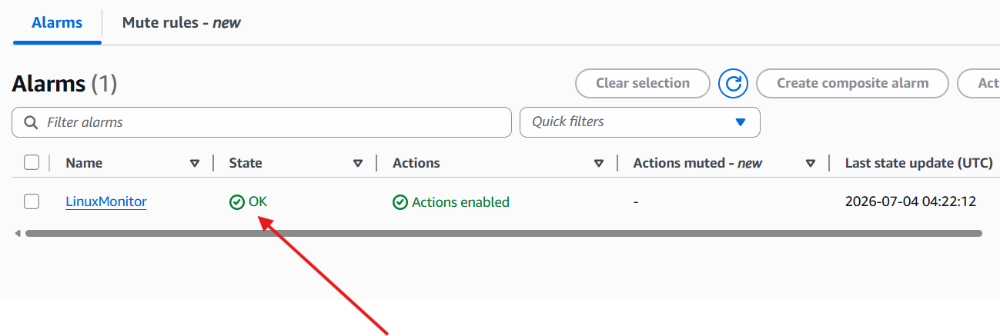

- It must show status OK if showing insufficient Data means check the Instance ID which you are monitoring. If its incorrect It shows In sufficient Data.

## Let's Increase load on this CPU

- connect with EC2 Instance (Direct connect from browser)
- execute below commands

```bash
sudo yum install stress -y
stress --cpu 2 --timeout 300
# Runs 2 CPU for 5 minutes 
```

- Normal Result
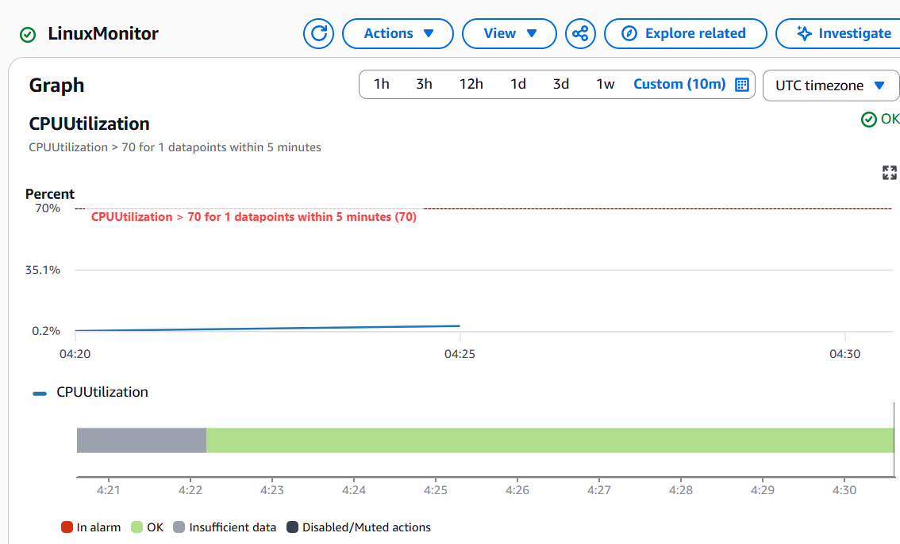

- InAlarm Situation
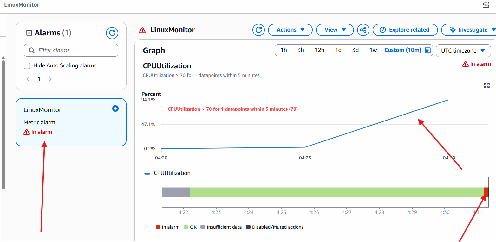

- Check your email, you must have received Email for Alarm Triggered.

- again go to VM shell and stop the command execution
- again check Cloudwatch Alarm will be in OK state.