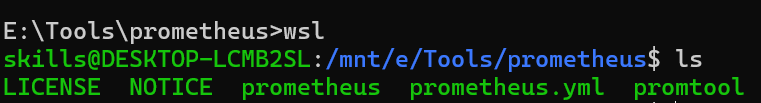
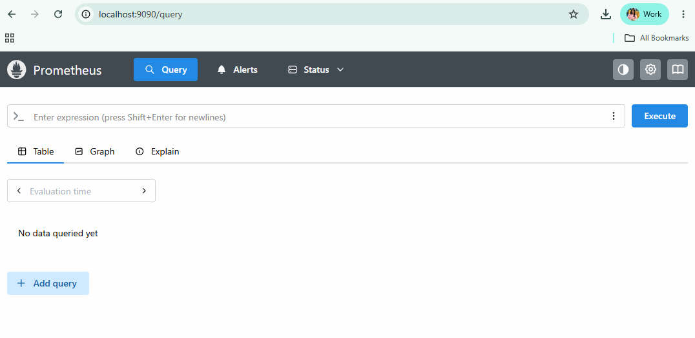

# Create Prometheus SetUp

- Download Prometheus [Link to Download](https://prometheus.io/download/)
- If you want to run it in WSL download the linux one.
- extract the folder and keep it in some seperate folder named tools and use it from there.
- rename folder to prometheus only
- open that folder from wsl



```bash
ls # check files and folders available
nano prometheus.yml
./prometheus
# Start Prometheus
# keep it running don't close the cli
# check in browser localhost:9090
```
**If getting error Port:9090 is already in use**
- find which process Id using port 9090: sudo lsof -i :9090
- sudo kill PID (Type process Id which is visible above)



- Check Runnig targets
- http://localhost:9090/targets

- here you can see only one target which is Prometheus.
- means Prometheus is running.
- It is scrapping its own metrics. No other systems configured yet to monitor.

## I want to monitor my Own System

- Download Node Exporter (used to take metrics of own system)
- It creates metrics at http://localhost:9100/metrics
- we will give this url to prometheus to monitor

## Download Node Exporter
- Its available on same link from where prometheus downloaded.
- donwload, extract and open it in wsl
- run ./node-exporter
- once its started check this link in browser
- http://localhost:9100/metrics (if its giving some data means its working fine)

## Now configure this NodeExporter to Prometheus for monitor

- stop perviously running Prometheus. Edit yml file again.

```yml
# my global config
global:
  scrape_interval: 15s
  evaluation_interval: 15s
scrape_configs:
  - job_name: "prometheus"
    static_configs:
      - targets: ["localhost:9090"]
        labels:
          app: "prometheus"
  - job_name: "node"
    static_configs:
      - targets: ["localhost:9100"]
        labels:
          app: "node"
```

- start prometheus again
- again check targets, now you can see 2 targets up.
- means now prometheus is monitoring your system.

## PromQ

- Memory Usage: node_memory_MemFree_bytes
- disk Usage: node_filesystem_size_bytes
- CPU Usage
- 100*(1-avg(rate(node_cpu_seconds_total{mode="idle"}[1m])))

# Grafana (Visualization Dashboard)

[Download Grafana](https://grafana.com/grafana/download)

```bash
sudo apt-get install -y adduser libfontconfig1 musl
wget https://dl.grafana.com/grafana/release/13.1.0/grafana_13.1.0_28013217238_linux_amd64.deb
sudo dpkg -i grafana_13.1.0_28013217238_linux_amd64.deb

sudo /bin/systemctl daemon-reload
sudo /bin/systemctl enable grafana-server
### You can start grafana-server by executing
sudo /bin/systemctl start grafana-server
sudo /bin/systemctl status grafana-server
```

- access in browser: localhost:3000
- default credentials: admin/admin
- skip for change password and continue

- On garafana Dashboard
- left panel -> data sources -> click on add new datasource --> select prometheus
- link: http://localhost:9090
- click on save + Test (if you got successful)
- means we connected Grafana with prometheus Data Source


## Creating OWN Dashboard

- click on dashbards -> create New -> click on add Panel -> click on visulization
- write PromQ query: click on code if not abale to write query

1. 100*(1-avg(rate(node_cpu_seconds_total{mode="idle"}[1m])))
    - execute query
    - select Graph/linechart/ you can see options and add
    - give the panel name and save
    - while save add you comments
    - It works like how you commit in Github
2. System Load: node_load1
    - histrogram
3. Running Processes:
    - node_procs_running
    - select stat

## Use Readymade Templates for Creating Dashboard

- go to dashboard
- click on import dashboard
- where you can see link to explore dashboards
- https://grafana.com/grafana/dashboards/
- you can see node exporter full : open it check Id
- in grafana: add that Id and import
- rename : now your dashboard is ready
- explore all queries written

