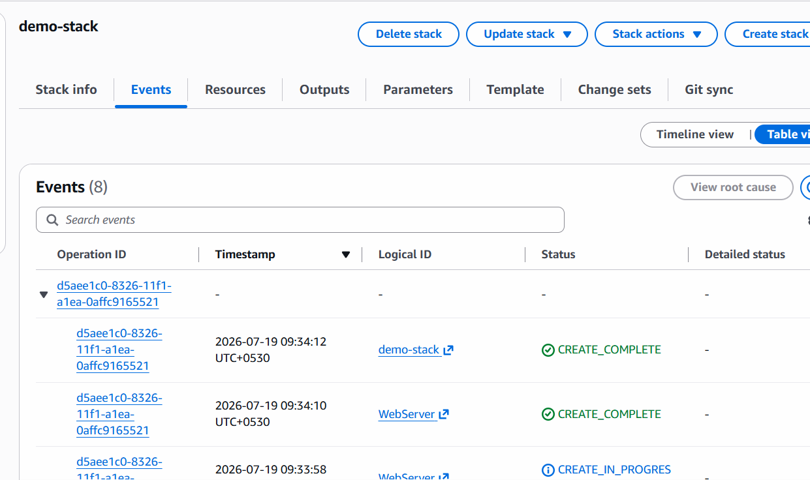
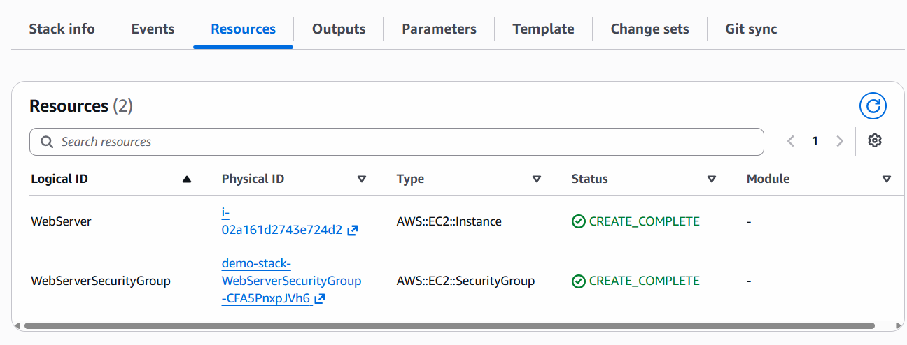
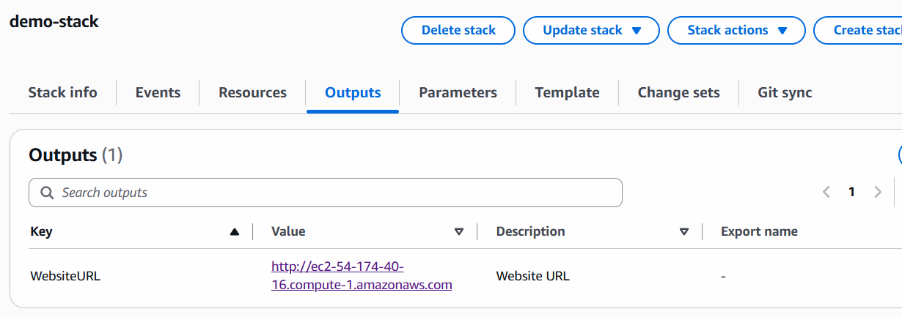

# CloudFormation

- IaaC
- instead of manually  creating S3, EC2, ALB, VPC create using code
- use complete template (YAML)
- cloud formation will create all

1. Template:
   - a file written in YML
   - define resources like EC2, Sec Group, S3 etc
2. Stack:
   - its a running instance of your template
   - when we deploy this cloud formation file -> it creates stack
3. Resources:
   - aws Resources: S3, EC2, iam, RDS
4. Parameters:
   - input which we can pass dynamically (variables)
   - instance-type: t2-micro
5. Outputs:
   - values returned after stack created successfully.
   - returning public IP/DNS of EC2 instance.

## Implementing stack

- create file firststack.yml and add code shown in that file
- execute below commands

```bash
# open WSL: go to the file location
aws cloudformation create-stack --stack-name demo-stack --template-body file://firststack.yml

# if you edit your resource file then use update command
aws cloudformation update-stack --stack-name demo-stack --template-body file://firststack.yml

# For Delete Stack
aws cloudformation delete-stack --stack-name demo-stack
```

## verify all from AWS Console







- try to access the link and if you can see Hello World!, App delopyed successfully!

## For Creating Resource follow below Docs

[Documentation](https://docs.aws.amazon.com/AWSCloudFormation/latest/TemplateReference/aws-template-resource-type-ref.html)