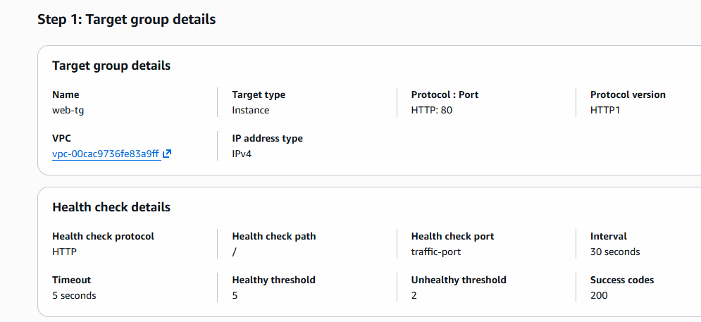
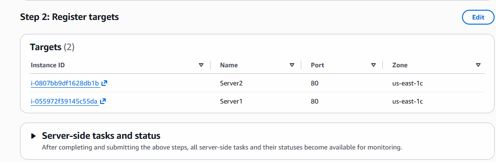

# Creating Application Load Balancer

1. Step-1: create 2 AWS Linux instances
    - setup apache httpd server which shows some simple HTML Page
2. Connect with instance 1 by one and execute below commands.

```bash
sudo yum update
sudo yum install -y httpd
sudo systemctl enable httpd
sudo systemctl start httpd
# do this in server1
echo "<h1>Hello From Server1</h1>" | sudo tee /var/www/html/index.html
# do this in server2
echo "<h1>Hello From Server2</h1>" | sudo tee /var/www/html/index.html
```
3. Group Them in Target Group
- on EC2 dashboard scroll left side and see load balancing section
- there you can see option for Target Group
- click on it
- create Target Group
- keep the default options name: web-tg
- next-> select registered targets
- selet both instances -> include as pending below click
- add - below you can see added targets
- next -> check summary as below
- create target group




4. Create Load Balancer
- click on load balancer -> create
- click App. Load Balancer
- create new Load Balancer
- Name: web-lb
- Scheme: Internet-facing
- Ip Type: IPv4
- Network Mapping: default VPC
- select atleast 2 AZ (us-east-1a, us-east-1b)
- select subnet based on your instance like whene it is running

*LB requires atleast 2 subnets in diffrent AZs*

- security group: choose 1 where port 80 is Open
- Listener: HTTP/80
- Target Groups: forward to target group
- select our created TargetGroup (web-tg)
- keep all configurations default and create load balancer

- check Loadbalancer state (Active)
- check Targetgroups both target state they must be Healthy

- then we can check LoadBalancer DNS (http)
- when you access you can see sometimes you are getting response from instance 1 and sometime response will come from instance2.


## Practice Task Using Terraform

1. Create 2 EC2 instance 
    - use count=2 for cretaing 2 instance
    - write logic to give name using index
    - let's say it takes server0 and server1 names
    - also use userdata to set up httpd
    - create new Sec Group (allow 22 and 80) and attach to both instance

2. Create Target Create and add above created instance variables inside targets

3. create load balancer and attach above created Target group to loadbalancer. 
    - Same Security group use for loadbalancer too.

4. In output give DNS of loadbalancer.