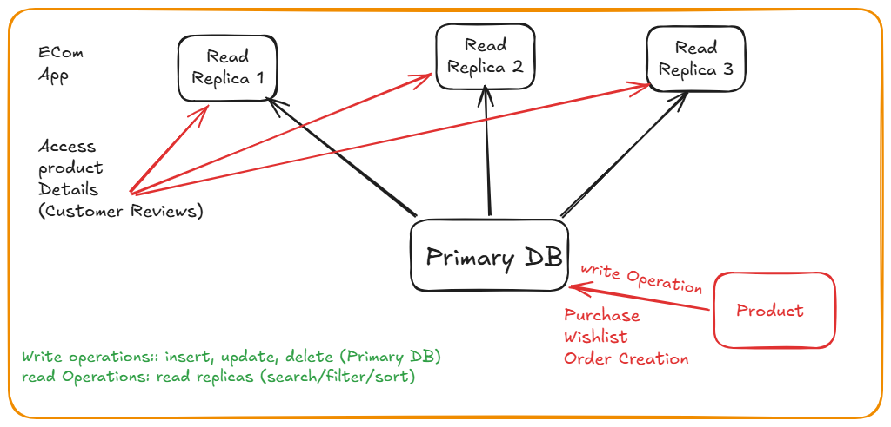

# RDS Relational Database

- Create Database
- Full Configuuration (for advanced configuration like security and all)
- when you choose mysql
- scroll and select mysql DB creation method Easy Create
- mysql community -> free tier
- db name: mydb
- master username: admin
- password self managed: Admin123 (no special symbols allowed)
- create database


## Create one Instance Amazon Linux
- add security group with port open for MySQL

## Connect RDS to EC2
- From RDS -> connect with compute resources
- select EC2-> Select Instance -> Connect

```bash
# install command line client
sudo dnf install mariadb105
mysql --version

# Connect with DB
#  from DB copy endpoint
mysql -h mydb.c8xaeuki2r7w.us-east-1.rds.amazonaws.com -u admin -p
# enter password, enter again
#  once connected you can try to run some sql queris
show databases;
create database xyz;
show databases;
exit
#  you will be exited from DB
```

## Read Replica

