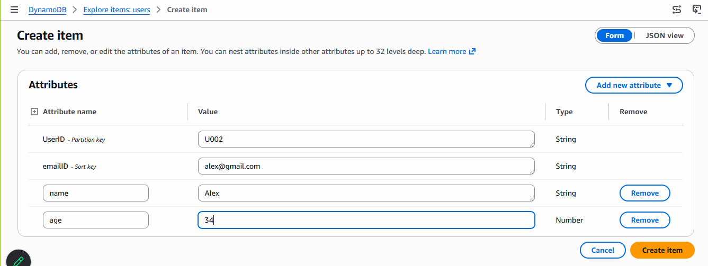
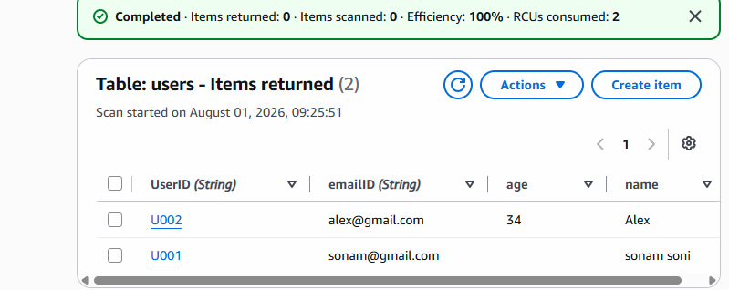
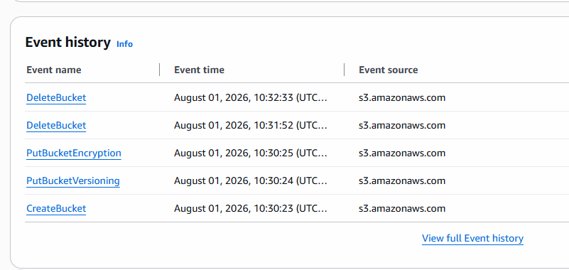

# DynamoDB

- It is a serverless, high performance and no SQL service in AWS
- best for app which needs fast and scalable data access.

## DB creation

- AWS console -> search for dynamodb
- create table: name users
- partitiona key (primary key) - UserID (data type string)
- sort (secondary key) like EmailID
- default settings
- create table
- once it is created click on that.
- click in explore table items.
- create Item





# access via CLI

```bash
aws dynamodb get-item --table-name users --key '{"UserID":{"S":"U001"},"emailID":{"S":"sonam@gmail.com"}}'

aws dynamodb put-item --table-name users --item '{"UserID":{"S":"U003"},"emailID":{"S":"bob@gmail.com"},"name":{"S":"Bob"},"age":{"N":"34"}}'
```

[Dynamo DB queries DOC](https://docs.aws.amazon.com/cli/latest/reference/dynamodb/)


# CloudTrail

- records every API call and actions in your account.
- like who did, what and when from which region.

## how to use it

- cloudTrain search on aws console
- create trail: give name
- it will create (default s3 bucket to store data)
- create

# verify

- check s3 bucket created for cloud trail
- now try to create some bucket and enable versioning, delete it
- check event history in cloud trail
- you can see all data



*Delet cloudtrail once the task completed*