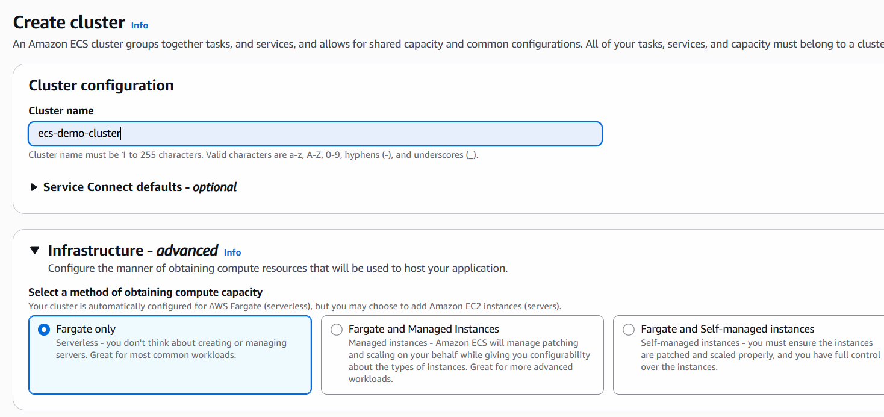
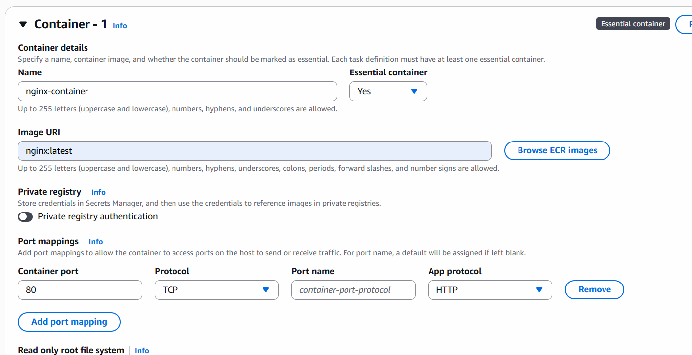

# ECS cluster and launch Service

- ESC runs containers, scale them and manage via aws.
-  Let's Create Cluster
-  

- keep all other options as It s and create cluster.

- once cluser is ready click on the link
- under that you can see left side panel task-defination
- Task defination is the blue print of container, memory, image, CPU, memory, port
- click on task defination

- task defination name: frontend
- launch type: aws farget
- os: linux
- size: CPU: 0.25 and Memory: 0.5
- Task role: Give None
- Task Execution Role: Create new with default policy and select

- keep all options default and create

*Configuration is ready now I want to use as loadbalancer*

## EC2 dashboard and create target group

- select Ip address
- name: ecs-nginx-tg
- protocol: HTTP
- Port: 80
- Keep default other options -> next -> next -> create
  
## create Load Balancer

- create ALB
- name: ecs-alb -> select internet facing
- IPV4
- choose all availability Zone
- security group: default + 1 where port 80 open
- forward to tagret group: choose your created target group
- create loadbalancer

## Create Service

- go to task defination
- click on deploy and select create service
- by default selected task defination is frontend
- revison: 1 (means first version)
- keep environment as it is
- replica: 2
- keep all other options as it is
- expand load balancing drop down'
- check on load balancer
- select existing loadbalancer
- existing listener
- existing target group
- create service

- once service created you can check
- status
- if its showing service runnig
- check target group, will show 2 healthy containers
- check load balancer (open url in browser)
- you cna see the responce coming from the container

## Delete All your resources created

- Delete Target Groups
- Delete Load balancer
- Delete Service (ECS)
- Delete Task Defination
- Delete Cluster

# Edit Security Groups

- open any security group
- check inbound rules
- edit inbound rule
- add port number in custom TCP and save rules
- HTTP (80), SSH(22), HTTPS(443)
- for other port number choose custom TCP and give Port which you want to use.