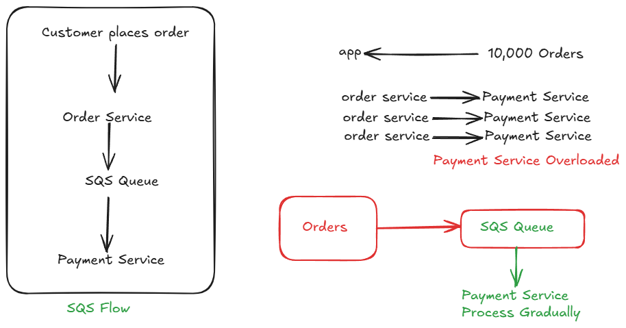
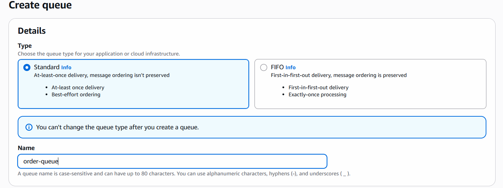

# SQS

- Simple Queue Service
- Helps to decouple microservices.



# Implement

- Create SQS queue



- keep all other options as default only.
- create queue

- create producer.py and consumer.py
- edit the file and add your SQS queue URL
- start producer and run it multiple times to send orders
  
```bash
sudo apt install python3-boto3
python3 producer.py # run it multiple times to generate multiple orders

# Open the another terminal
python3 consumer.py 
# this will process your orders which are available in the queue.
# try to stop consumer, produce multiple orders
# run consumer again and see all the pending orders processed by consumer.
```